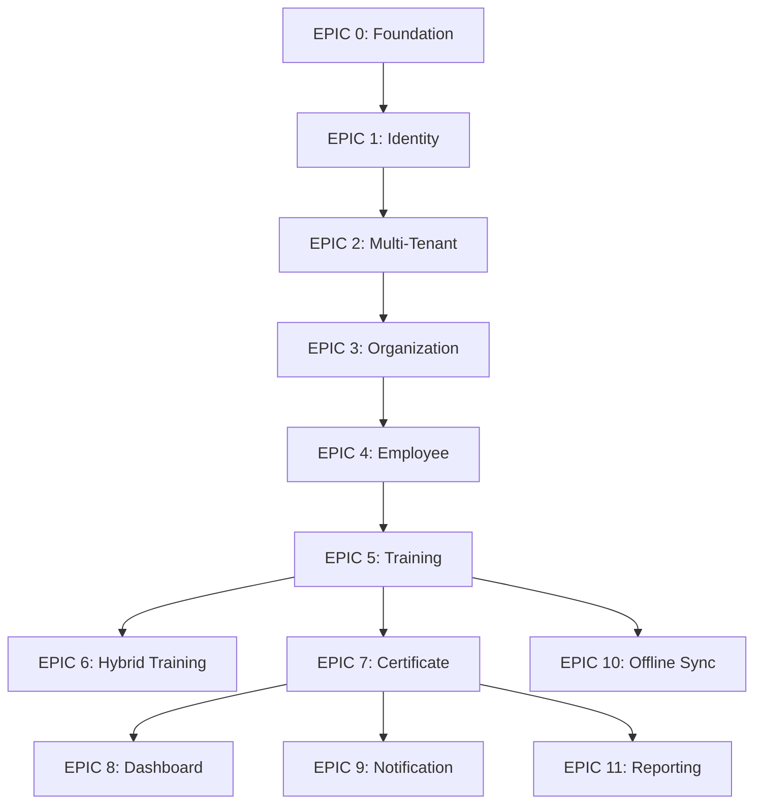

# Implementation Backlog — prioritized roadmap

This backlog outlines the implementation order for the SafeFlow-AI Phase 0-1 (MVP) development, mapping the backlog epics to the sprint schedule.

---

## 1. Development Roadmap Overview

| Sprint | Epic | Scope | Priority | Target Architecture |
|---|---|---|---|---|
| **Sprint 1** | [EPIC 0: Foundation](file:///c:/Users/drmus/Desktop/SafeFlow-AI/docs/backlog/epic-00-foundation.md) | Clean Architecture setup, MediatR, DbContext & SQL Server setup, Serilog, Hangfire | P0 | .NET 9, SQL Server 2022 |
| **Sprint 1-2** | [EPIC 1: Identity](file:///c:/Users/drmus/Desktop/SafeFlow-AI/docs/backlog/epic-01-identity-authentication.md) | User aggregate, JWT RS256, Refresh Token Family Rotation, Login/Register APIs | P0 | MS Identity integration |
| **Sprint 2** | [EPIC 2: Multi-Tenant](file:///c:/Users/drmus/Desktop/SafeFlow-AI/docs/backlog/epic-02-multi-tenant.md) | Tenant-Company global query filter, Resolution middleware, Subscription plans | P0 | EF Core Global Filters |
| **Sprint 3** | [EPIC 3: Organization](file:///c:/Users/drmus/Desktop/SafeFlow-AI/docs/backlog/epic-03-organization-management.md) | Company Info, Departments, Locations management | P0 | DDD Aggregates |
| **Sprint 3-4** | [EPIC 4: Employee](file:///c:/Users/drmus/Desktop/SafeFlow-AI/docs/backlog/epic-04-employee-management.md) | Employee aggregate, employment info, hire/terminate state machine | P0 | Supporting Domain BC |
| **Sprint 4-5** | [EPIC 5: Training](file:///c:/Users/drmus/Desktop/SafeFlow-AI/docs/backlog/epic-05-training-management.md) | Training aggregate, session scheduled, participation tracking | P0 | Core Domain BC |
| **Sprint 5** | [EPIC 6: Hybrid Training](file:///c:/Users/drmus/Desktop/SafeFlow-AI/docs/backlog/epic-06-hybrid-training.md) | Online & FaceToFace modes, meeting URL configurations | P1 | Feature expansion |
| **Sprint 5-6** | [EPIC 7: Certificate](file:///c:/Users/drmus/Desktop/SafeFlow-AI/docs/backlog/epic-07-certificate-management.md) | Auto certificate generator on training pass, validity period checker | P0 | Core Domain BC |
| **Sprint 6** | [EPIC 8: Dashboard](file:///c:/Users/drmus/Desktop/SafeFlow-AI/docs/backlog/epic-08-dashboard.md) | Summary statistics, cached analytics widgets | P1 | Query optimization |
| **Sprint 6-7** | [EPIC 9: Notification](file:///c:/Users/drmus/Desktop/SafeFlow-AI/docs/backlog/epic-09-notification.md) | Email/Push notifications on training published and certificate issued | P1 | Infrastructure services |
| **Sprint 7** | [EPIC 10: Offline Sync](file:///c:/Users/drmus/Desktop/SafeFlow-AI/docs/backlog/epic-10-offline-sync.md) | Mobile delta synchronization & conflict resolution API | P1 | Sync framework |
| **Sprint 7-8** | [EPIC 11: Reporting](file:///c:/Users/drmus/Desktop/SafeFlow-AI/docs/backlog/epic-11-reporting.md) | QuestPDF / ClosedXML report generation backend | P1 | Document generator |

---

## 2. Priority Logic & Dependencies

### Dependency Rules:
1.  **Solution & Data Layer First (Sprint 1):** You cannot build domain aggregates without a compiling solution structure and database context.
2.  **Auth & Security Boundary (Sprint 1-2):** All operation endpoints require authentication. Hence, the login, token, and user registration flows must be operational before other business modules are exposed.
3.  **Multi-Tenancy (Sprint 2):** Since SQL Server tenant isolation is applied at the EF Core Global Query Filter level, this database structure must be finalized before adding any other business aggregates (Company, Employee, Training) to ensure their tables inherit `ITenantEntity` properly.
4.  **Organization & Employee Hierarchy (Sprint 3-4):** Trainings are scheduled for specific departments, and certificates are issued to employees. Therefore, Company and Employee aggregates must be fully operational before Training and Certificate modules are implemented.

---

## 3. Future Roadmap Phase Mapping

The epics defined in this backlog cover Phase 0 (Foundation) and Phase 1 (Core MVP). Subsequent phases of the Product Vision will have corresponding epics generated at the start of their respective planning cycles:

*   **Phase 2 — Risk & Audit (Sprint 9-12):** Will introduce Epics covering Risk Assessment methodologies (Fine-Kinney, 5x5 Matrix) and Site Audit/Inspection management.
*   **Phase 3 — Incident & CAPA Compliance (Sprint 13-15):** Will introduce Epics for Work Accident/Near-Miss reporting, SGK automatic notification integration, and Corrective Action (CAPA/DÖF) tracking.
*   **Phase 4 — AI-Powered Features (Sprint 16+):** Will introduce Epics for FastAPI-driven risk recommendation algorithms and YOLO-based PPE violation detection integrations.
