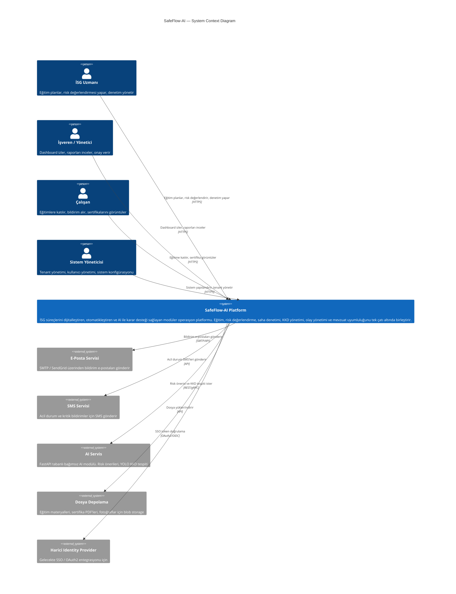
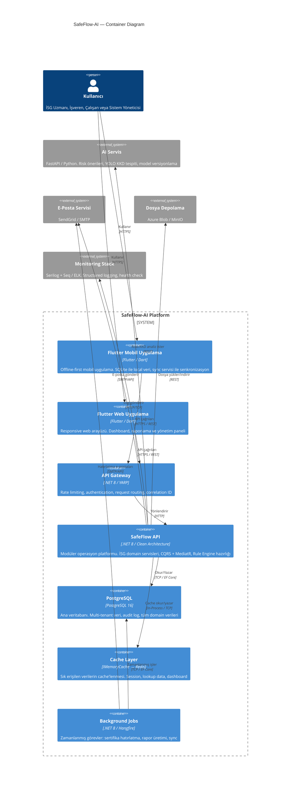
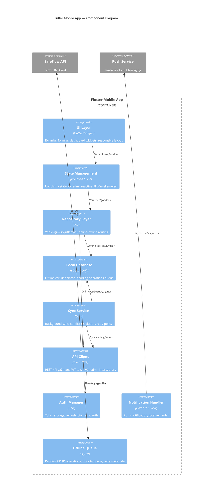
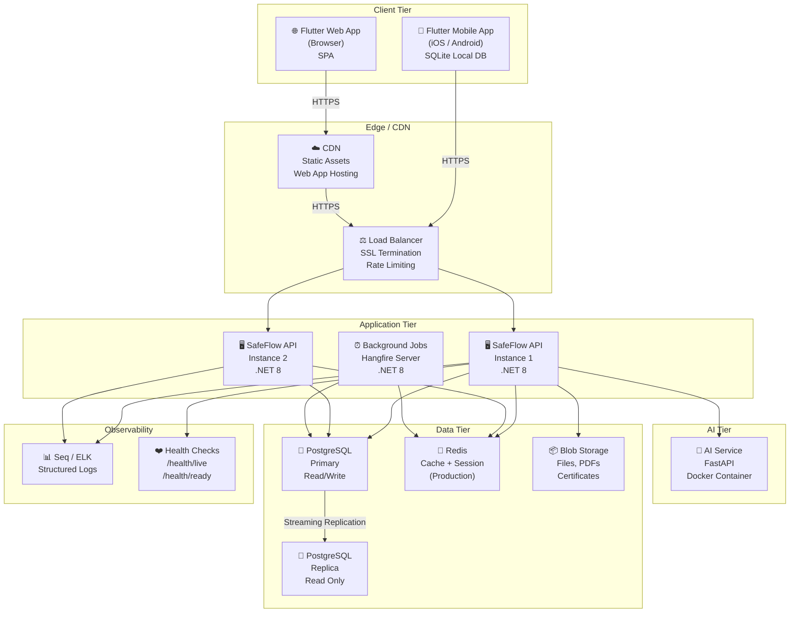
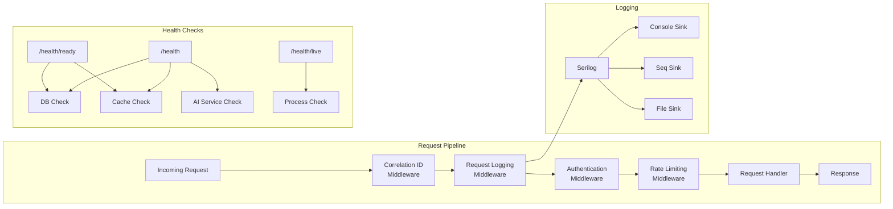
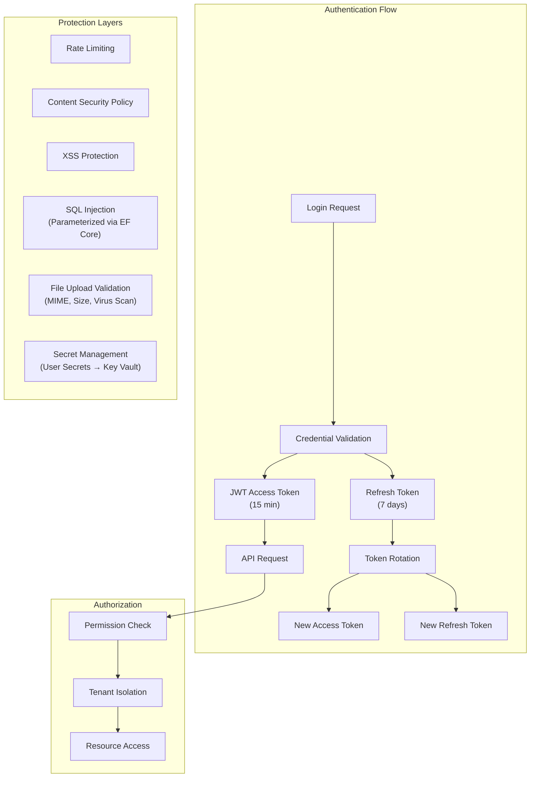
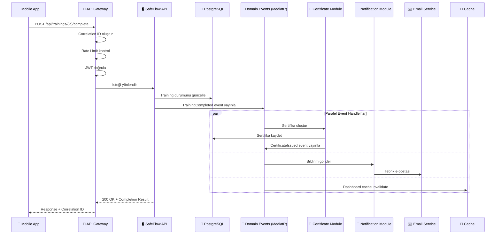

# SafeFlow-AI — C4 Architecture Diagrams

> **Versiyon:** 1.1  
> **Tarih:** 2026-07-07  
> **Durum:** Taslak — Onay Bekliyor

> [!IMPORTANT]
> **SafeFlow-AI**, yalnızca bir İSG yazılımı değildir. İş Sağlığı ve Güvenliği süreçlerini
> dijitalleştiren, otomatikleştiren ve yapay zekâ ile karar desteği sağlayan **modüler bir
> operasyon platformudur**. Eğitim, risk değerlendirme, saha denetimi, KKD yönetimi, olay
> yönetimi ve mevzuat uyumluluğunu tek çatı altında birleştirir.

---

## 1. Level 1 — System Context Diagram

Sistemin dış dünya ile etkileşimini gösterir. SafeFlow-AI'ın kullanıcıları (persona'lar) ve bağımlı olduğu harici sistemler bu seviyede tanımlanır.



### Persona Detayları

| Persona | Rol | Temel Eylemler | Erişim |
|---------|-----|----------------|--------|
| **İSG Uzmanı** | Operasyonel kullanıcı | Eğitim planlama, risk değerlendirme, denetim, DÖF, iş kazası kaydı | Web + Mobil |
| **İşveren / Yönetici** | Karar verici | Dashboard, raporlar, onay süreçleri, trend analizi | Web |
| **Çalışan** | Son kullanıcı | Eğitime katılım, sertifika görüntüleme, bildirim alma | Mobil (öncelikli) |
| **Sistem Yöneticisi** | Teknik yönetici | Tenant yönetimi, kullanıcı yönetimi, sistem konfigürasyonu | Web |

---

## 2. Level 2 — Container Diagram

Sistemin teknik bileşenlerini (container'lar) ve aralarındaki iletişimi gösterir.



### Container Sorumlulukları

| Container | Teknoloji | Sorumluluk | MVP Durumu |
|-----------|-----------|------------|------------|
| **Flutter Mobil App** | Flutter 3.x / Dart | Offline-first mobil deneyim, SQLite local DB, sync servisi | ✅ MVP |
| **Flutter Web App** | Flutter 3.x / Dart | Responsive web arayüzü, dashboard, yönetim paneli | ✅ MVP |
| **API Gateway** | .NET 8 / YARP | Rate limiting, auth, routing, correlation ID, request tracing | ✅ MVP (basit) |
| **SafeFlow API** | .NET 8 / Clean Architecture | Tüm iş mantığı, CQRS, MediatR, domain servisleri | ✅ MVP |
| **PostgreSQL** | PostgreSQL 16 | Multi-tenant veritabanı, Row Level Security | ✅ MVP |
| **Cache Layer** | IMemoryCache → Redis | Performans optimizasyonu | ✅ MVP (Memory) |
| **Background Jobs** | Hangfire | Zamanlanmış görevler, hatırlatmalar | ✅ MVP (temel) |
| **AI Servis** | FastAPI / Python | Risk önerileri, YOLO KKD tespiti | ⏳ Phase 2 |

### MVP → Production Geçiş Yolu

```
MVP (Phase 0-1)                    Production (Phase 2+)
─────────────────                  ─────────────────────
IMemoryCache                  →    Redis Cluster
MediatR (in-process events)   →    MassTransit + RabbitMQ
Basit API Gateway             →    YARP + Ocelot
Local file storage            →    Azure Blob Storage
Console logging               →    Serilog + Seq/ELK
Hangfire (in-process)         →    Hangfire (dedicated server)
Single instance               →    Horizontal scaling + Load Balancer
```

---

## 3. Level 3 — Component Diagram (SafeFlow API)

Backend API'nin iç bileşenlerini detaylı olarak gösterir.

```mermaid
C4Component
    title SafeFlow API — Component Diagram

    Container_Boundary(api_boundary, "SafeFlow API (.NET 8)") {

        Component(auth_module, "Authentication Module", "JWT + Refresh Token", "Kimlik doğrulama, token üretimi, token rotation, permission-based yetkilendirme")
        Component(user_module, "User Management", "CQRS + MediatR", "Kullanıcı CRUD, rol atama, profil yönetimi")
        Component(tenant_module, "Tenant Management", "Multi-Tenant", "Şirket/tenant oluşturma, tenant isolation, ayarlar")
        Component(training_module, "Training Module", "CQRS + MediatR", "Eğitim planlama, oturum yönetimi, katılım takibi, materyal yönetimi")
        Component(cert_module, "Certificate Module", "CQRS + MediatR", "Sertifika üretimi, şablon yönetimi, geçerlilik takibi, yenileme hatırlatma")
        Component(company_module, "Company Module", "CQRS + MediatR", "Departman, lokasyon, çalışan yönetimi")
        Component(dashboard_module, "Dashboard Module", "Query Only", "Widget tabanlı dashboard, trend analizi, departman istatistikleri, AI önerileri")
        Component(report_module, "Report Module", "QuestPDF + ClosedXML", "PDF, Excel, CSV rapor üretimi, şablon tabanlı")
        Component(notification_module, "Notification Module", "MediatR Events", "E-posta, push notification, in-app bildirim")
        Component(health_module, "Health & Observability", "ASP.NET Health Checks", "Liveness, readiness, DB health, cache health")
        Component(sync_module, "Sync Module", "REST API", "Mobil offline sync, conflict resolution, delta sync")

        Component(middleware_stack, "Middleware Stack", "ASP.NET Middleware", "Correlation ID, request tracing, exception handling, rate limiting")
        Component(domain_events, "Domain Event Bus", "MediatR INotification", "In-process domain event dispatching")
        Component(rule_engine, "Rule Engine Interface", "IRuleEngine", "İş kuralları soyutlaması, gelecekte configurable rules")
    }

    ContainerDb(database, "PostgreSQL", "Ana veritabanı")
    Container(cache, "Cache", "IMemoryCache / Redis")
    System_Ext(ai_service, "AI Service", "FastAPI")
    System_Ext(email, "Email Service", "SendGrid")
    System_Ext(storage, "File Storage", "Blob Storage")

    Rel(auth_module, database, "Kullanıcı/token okur-yazar")
    Rel(user_module, database, "Kullanıcı verileri")
    Rel(tenant_module, database, "Tenant verileri")
    Rel(training_module, database, "Eğitim verileri")
    Rel(cert_module, database, "Sertifika verileri")
    Rel(company_module, database, "Şirket verileri")
    Rel(dashboard_module, database, "İstatistik sorguları")
    Rel(dashboard_module, cache, "Cache'lenmiş dashboard verileri")
    Rel(report_module, database, "Rapor verileri")
    Rel(notification_module, email, "E-posta gönderimi")
    Rel(training_module, domain_events, "TrainingCompleted event yayınlar")
    Rel(cert_module, domain_events, "CertificateIssued event yayınlar")
    Rel(domain_events, notification_module, "Event'leri dinler, bildirim gönderir")
    Rel(dashboard_module, ai_service, "AI önerisi ister")
    Rel(cert_module, storage, "PDF sertifika depolar")
    Rel(training_module, storage, "Eğitim materyali depolar")
```



### Modül Detay Matrisi

| Modül | Katman | Pattern | Domain Events | MVP |
|-------|--------|---------|---------------|-----|
| **Authentication** | Infrastructure | JWT + Refresh Token | `UserLoggedIn`, `TokenRefreshed` | ✅ |
| **User Management** | Application + Domain | CQRS | `UserCreated`, `UserUpdated`, `RoleAssigned` | ✅ |
| **Tenant Management** | Application + Domain | CQRS | `TenantCreated`, `TenantSettingsUpdated` | ✅ |
| **Training** | Application + Domain | CQRS + State Machine | `TrainingCreated`, `TrainingScheduled`, `TrainingCompleted`, `ParticipantEnrolled` | ✅ |
| **Certificate** | Application + Domain | CQRS + State Machine | `CertificateIssued`, `CertificateExpiring`, `CertificateRevoked` | ✅ |
| **Company** | Application + Domain | CQRS | `DepartmentCreated`, `EmployeeAssigned` | ✅ |
| **Dashboard** | Application (Query) | Read Model | — | ✅ |
| **Report** | Application | Template Pattern | `ReportGenerated` | ✅ |
| **Notification** | Infrastructure | Event Handler | — | ✅ |
| **Sync** | Application | Delta Sync | `SyncCompleted`, `ConflictDetected` | ✅ |
| **Health** | Infrastructure | Health Check | — | ✅ |

---

## 4. Level 3 — Component Diagram (Flutter Mobil App)



---

## 5. Deployment Diagram



### Ortam Matrisi

| Ortam | API Instances | DB | Cache | AI | Monitoring |
|-------|--------------|-----|-------|-----|------------|
| **Development** | 1 | PostgreSQL (Docker) | IMemoryCache | Mock/Local | Console |
| **Staging** | 2 | PostgreSQL (Managed) | Redis (Single) | FastAPI (Docker) | Seq |
| **Production** | 2+ (Auto-scale) | PostgreSQL (HA Cluster) | Redis (Cluster) | FastAPI (K8s) | Seq + ELK |

---

## 6. Cross-Cutting Concerns

### 6.1 Observability Stack



### 6.2 Security Architecture



---

## 7. Veri Akışı — Eğitim Tamamlama Senaryosu

Bu senaryo, C4 bileşenlerinin nasıl birlikte çalıştığını gösterir.



---

## Açık Sorular

| # | Soru | Etki |
|---|------|------|
| 1 | API Gateway olarak YARP mı yoksa basit reverse proxy mi (MVP)? | Container diagram |
| 2 | Flutter state management: Riverpod mı Bloc mu? | Mobile component diagram |
| 3 | File storage MVP'de local disk mi yoksa MinIO mu? | Deployment diagram |
| 4 | Monitoring MVP'de Seq mi yoksa sadece console + file mı? | Observability stack |
