# SafeFlow-AI — Domain Model

> **Versiyon:** 1.1  
> **Tarih:** 2026-07-07  
> **Durum:** Taslak — Onay Bekliyor  
> **Yaklaşım:** Domain-Driven Design (DDD)

> [!IMPORTANT]
> **SafeFlow-AI**, yalnızca bir İSG yazılımı değildir. İş Sağlığı ve Güvenliği süreçlerini
> dijitalleştiren, otomatikleştiren ve yapay zekâ ile karar desteği sağlayan **modüler bir
> operasyon platformudur**. Eğitim, risk değerlendirme, saha denetimi, KKD yönetimi, olay
> yönetimi ve mevzuat uyumluluğunu tek çatı altında birleştirir.
>
> Domain modeli bu vizyon etrafında şekillendirilmiştir: her modül bağımsız bir Bounded
> Context olarak tasarlanmış, modüller arası iletişim Domain Event'ler aracılığıyla
> sağlanmıştır. Bu yapı, platformun gelecekte yeni İSG modülleriyle genişletilmesini
> ve her modülün bağımsız ölçeklenmesini mümkün kılar.

---

## 1. Bounded Context Map

SafeFlow-AI, İSG (İş Sağlığı ve Güvenliği) alanını kapsayan çoklu bounded context'ten oluşur. Her bounded context kendi Ubiquitous Language'ına, Aggregate'lerine ve iç tutarlılığına sahiptir.

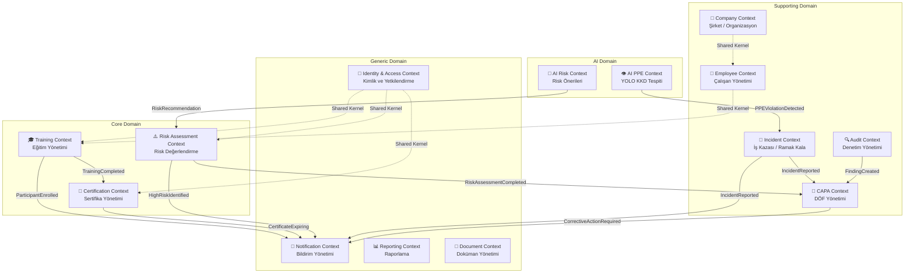

### Context İlişki Türleri

| Kaynak Context | Hedef Context | İlişki Türü | Açıklama |
|---------------|---------------|-------------|----------|
| Training → Certification | Downstream | Event-Driven | Eğitim tamamlanınca sertifika oluşturulur |
| Training → Notification | Downstream | Event-Driven | Eğitim planlandığında bildirim gönderilir |
| Risk → CAPA | Downstream | Event-Driven | Yüksek risk tespit edilince DÖF açılır |
| Incident → CAPA | Downstream | Event-Driven | İş kazası sonrası DÖF açılır |
| Identity → All Contexts | Shared Kernel | Direct | Kullanıcı kimlik bilgileri tüm context'lerde paylaşılır |

### MVP Kapsamı

| Context | MVP | Phase 1 | Phase 2 | Phase 3 |
|---------|-----|---------|---------|---------|
| **Identity & Access** | ✅ | | | |
| **Company** | ✅ | | | |
| **Employee** | ✅ | | | |
| **Training** | ✅ | | | |
| **Certification** | ✅ | | | |
| **Notification** | ✅ (temel) | ✅ (gelişmiş) | | |
| **Reporting** | | ✅ | | |
| **Risk Assessment** | | ✅ | | |
| **Incident** | | | ✅ | |
| **CAPA** | | | ✅ | |
| **Audit** | | | ✅ | |
| **Document** | | | ✅ | |
| **AI Risk** | | | | ✅ |
| **AI PPE** | | | | ✅ |

---

## 2. Shared Kernel

Tüm Bounded Context'ler arasında paylaşılan temel yapılar.

```csharp
// ── Base Entity ──────────────────────────────────────────────
public abstract class BaseEntity
{
    public Guid Id { get; protected set; }
    public DateTime CreatedAt { get; protected set; }
    public string CreatedBy { get; protected set; }
    public DateTime? UpdatedAt { get; protected set; }
    public string? UpdatedBy { get; protected set; }
    public bool IsDeleted { get; protected set; }   // Soft Delete
}

// ── Aggregate Root ───────────────────────────────────────────
public abstract class AggregateRoot : BaseEntity
{
    private readonly List<IDomainEvent> _domainEvents = new();
    public IReadOnlyList<IDomainEvent> DomainEvents => _domainEvents.AsReadOnly();

    protected void AddDomainEvent(IDomainEvent domainEvent)
        => _domainEvents.Add(domainEvent);

    public void ClearDomainEvents()
        => _domainEvents.Clear();
}

// ── Value Object ─────────────────────────────────────────────
public abstract class ValueObject
{
    protected abstract IEnumerable<object> GetEqualityComponents();

    public override bool Equals(object? obj)
    {
        if (obj is not ValueObject other) return false;
        return GetEqualityComponents()
            .SequenceEqual(other.GetEqualityComponents());
    }

    public override int GetHashCode()
        => GetEqualityComponents()
            .Aggregate(1, (current, obj) =>
                HashCode.Combine(current, obj?.GetHashCode() ?? 0));
}

// ── Domain Event ─────────────────────────────────────────────
public interface IDomainEvent : MediatR.INotification
{
    Guid EventId { get; }
    DateTime OccurredOn { get; }
    string EventType { get; }
}

public abstract record DomainEvent : IDomainEvent
{
    public Guid EventId { get; } = Guid.NewGuid();
    public DateTime OccurredOn { get; } = DateTime.UtcNow;
    public abstract string EventType { get; }
}

// ── Multi-Tenant ─────────────────────────────────────────────
public interface ITenantEntity
{
    Guid TenantId { get; }
}

// ── Audit ────────────────────────────────────────────────────
public interface IAuditableEntity
{
    DateTime CreatedAt { get; }
    string CreatedBy { get; }
    DateTime? UpdatedAt { get; }
    string? UpdatedBy { get; }
}
```

---

## 3. Identity & Access Context

### 3.1 Aggregate: User

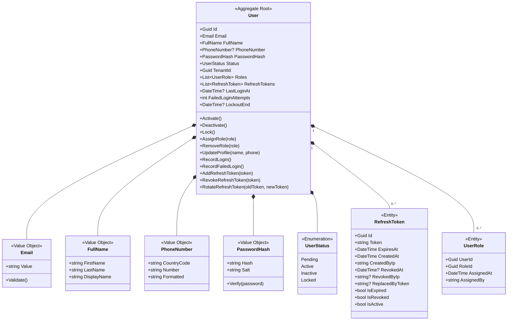

### 3.2 User State Machine

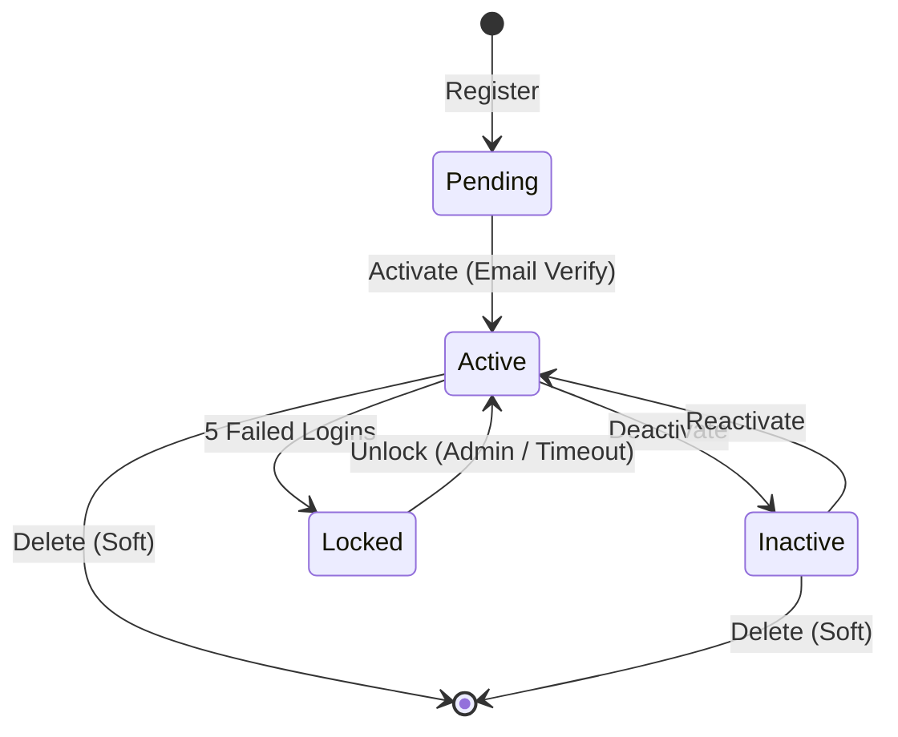

### 3.3 Aggregate: Role

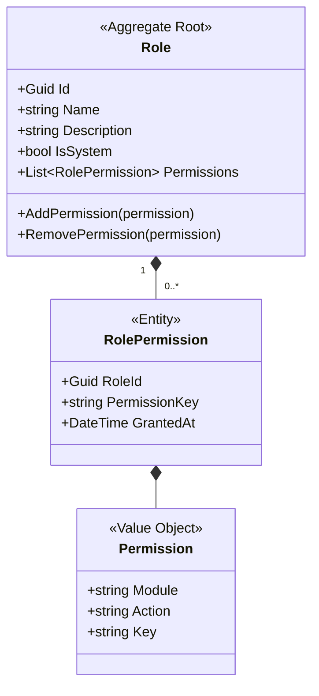

### 3.4 Permission Keys

```
Permissions:
  Users:
    - users.view
    - users.create
    - users.update
    - users.delete
    - users.assign-role
  Trainings:
    - trainings.view
    - trainings.create
    - trainings.update
    - trainings.delete
    - trainings.manage-participants
    - trainings.complete
  Certificates:
    - certificates.view
    - certificates.create
    - certificates.revoke
    - certificates.download
  Companies:
    - companies.view
    - companies.create
    - companies.update
    - companies.manage-departments
  Reports:
    - reports.view
    - reports.generate
    - reports.export
  Dashboard:
    - dashboard.view
    - dashboard.view-all-departments
  System:
    - system.manage-tenants
    - system.manage-settings
    - system.view-audit-log
```

### 3.5 Domain Events — Identity Context

```csharp
public record UserCreated(Guid UserId, Guid TenantId, string Email) : DomainEvent
{
    public override string EventType => "Identity.UserCreated";
}

public record UserActivated(Guid UserId) : DomainEvent
{
    public override string EventType => "Identity.UserActivated";
}

public record UserLocked(Guid UserId, string Reason) : DomainEvent
{
    public override string EventType => "Identity.UserLocked";
}

public record RoleAssigned(Guid UserId, Guid RoleId, string RoleName) : DomainEvent
{
    public override string EventType => "Identity.RoleAssigned";
}

public record RefreshTokenRotated(Guid UserId, string OldToken, string NewToken) : DomainEvent
{
    public override string EventType => "Identity.RefreshTokenRotated";
}
```

---

## 4. Company Context

### 4.1 Aggregate: Company (Tenant)

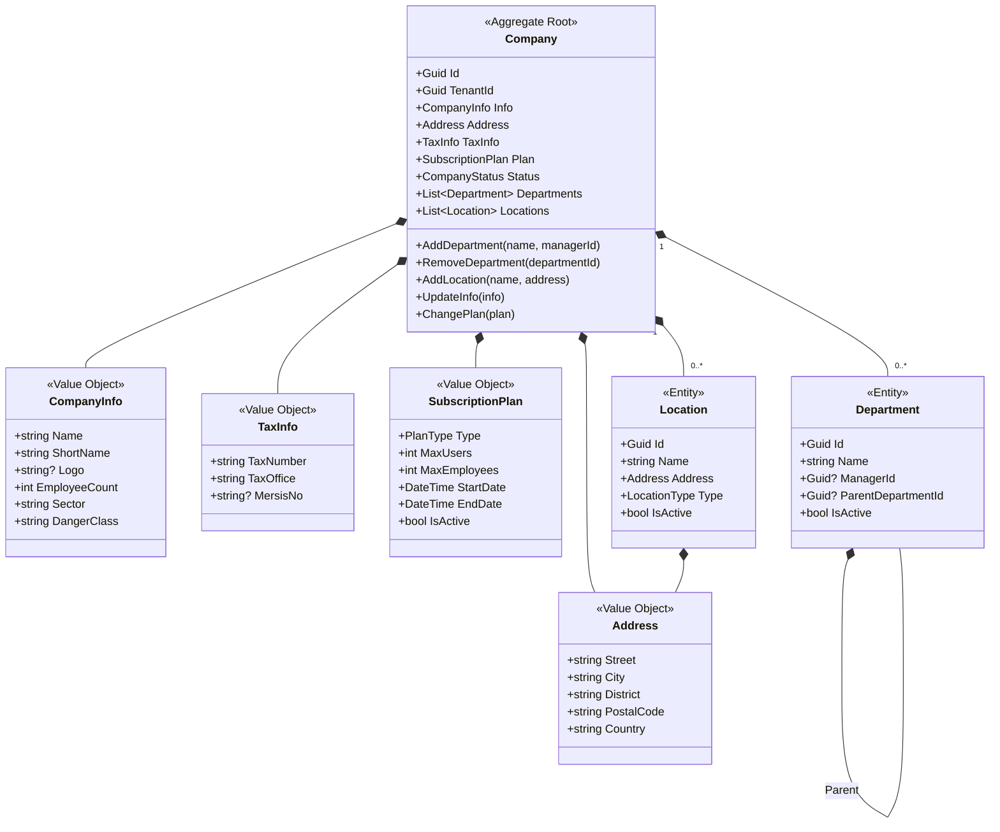

### 4.2 Aggregate: Employee

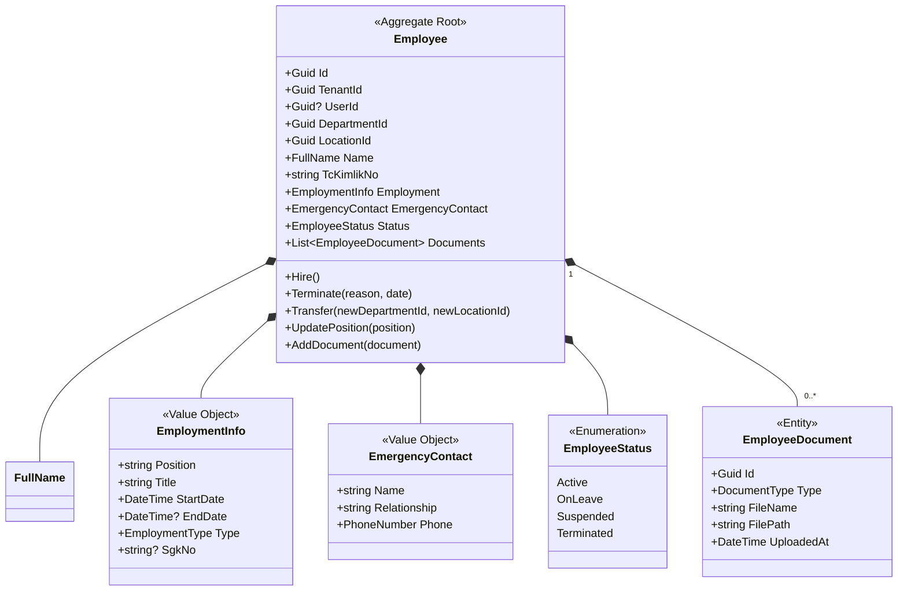

### 4.3 Employee State Machine

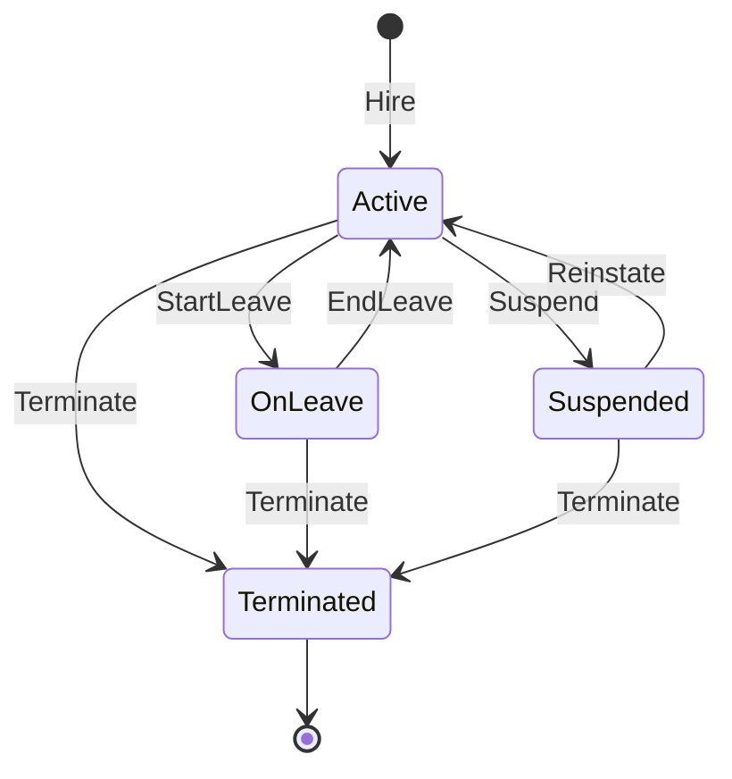

---

## 5. Training Context

### 5.1 Aggregate: Training

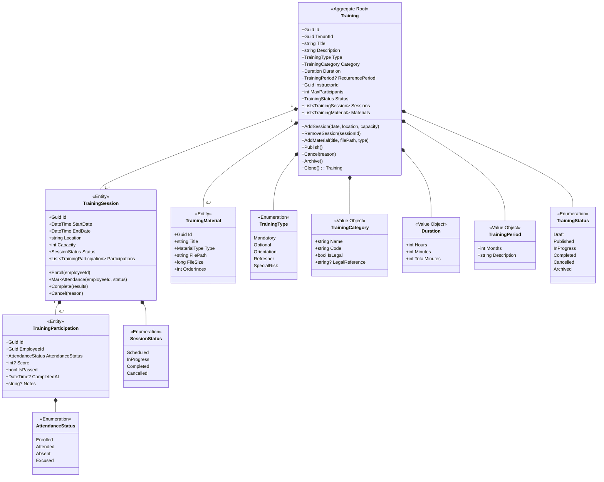

### 5.2 Training State Machine

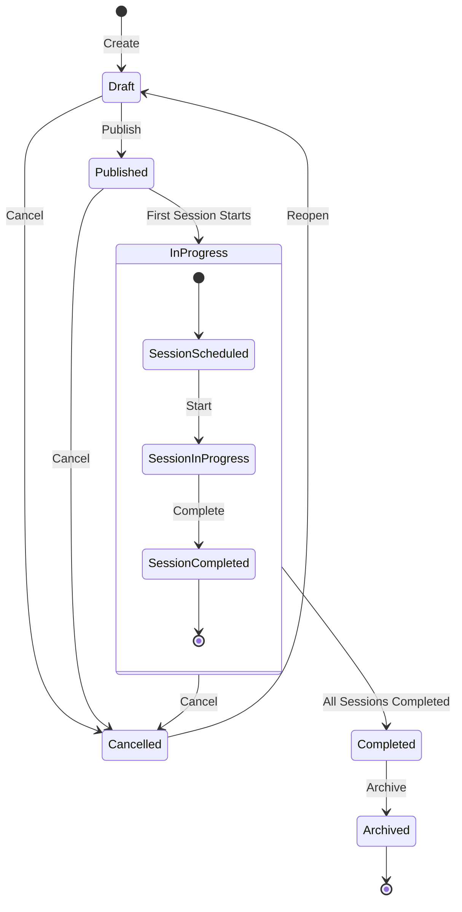

### 5.3 Domain Events — Training Context

```csharp
public record TrainingCreated(Guid TrainingId, Guid TenantId, string Title, TrainingType Type) : DomainEvent
{
    public override string EventType => "Training.TrainingCreated";
}

public record TrainingPublished(Guid TrainingId, string Title) : DomainEvent
{
    public override string EventType => "Training.TrainingPublished";
}

public record TrainingSessionScheduled(
    Guid TrainingId, Guid SessionId, DateTime StartDate, 
    string Location, int Capacity) : DomainEvent
{
    public override string EventType => "Training.SessionScheduled";
}

public record ParticipantEnrolled(
    Guid TrainingId, Guid SessionId, Guid EmployeeId) : DomainEvent
{
    public override string EventType => "Training.ParticipantEnrolled";
}

public record TrainingSessionCompleted(
    Guid TrainingId, Guid SessionId, 
    int TotalParticipants, int PassedCount) : DomainEvent
{
    public override string EventType => "Training.SessionCompleted";
}

public record TrainingCompleted(
    Guid TrainingId, string Title,
    List<Guid> PassedEmployeeIds) : DomainEvent
{
    public override string EventType => "Training.TrainingCompleted";
}

public record TrainingCancelled(Guid TrainingId, string Reason) : DomainEvent
{
    public override string EventType => "Training.TrainingCancelled";
}
```

### 5.4 Domain Service: TrainingEligibilityService

```csharp
public interface ITrainingEligibilityService
{
    /// <summary>
    /// Çalışanın eğitime katılma uygunluğunu kontrol eder.
    /// İş kuralları: Aktif çalışan, departman uyumu, 
    /// periyodik eğitim süresi, kontenjan.
    /// </summary>
    Task<EligibilityResult> CheckEligibility(Guid employeeId, Guid trainingSessionId);
    
    /// <summary>
    /// Periyodik eğitim yenileme süresine yaklaşan çalışanları bulur.
    /// </summary>
    Task<IReadOnlyList<TrainingRenewalInfo>> GetUpcomingRenewals(
        Guid tenantId, int daysAhead = 30);
}

public record EligibilityResult(
    bool IsEligible, 
    string? Reason, 
    List<string> Warnings);

public record TrainingRenewalInfo(
    Guid EmployeeId, 
    Guid TrainingId,
    string TrainingTitle,
    DateTime LastCompletedAt, 
    DateTime RenewalDueDate,
    int DaysRemaining);
```

---

## 6. Certification Context

### 6.1 Aggregate: Certificate

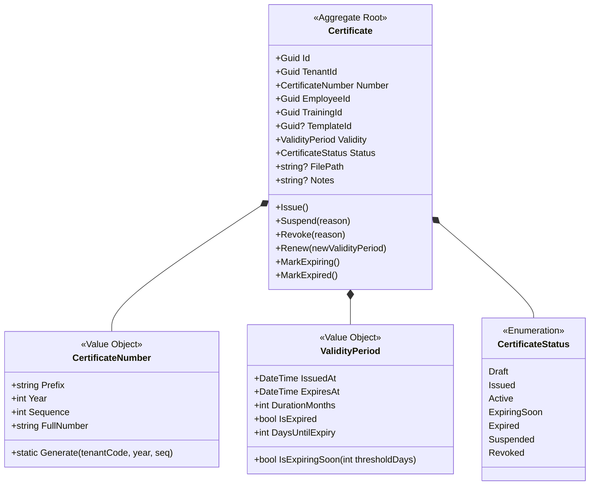

### 6.2 Certificate State Machine

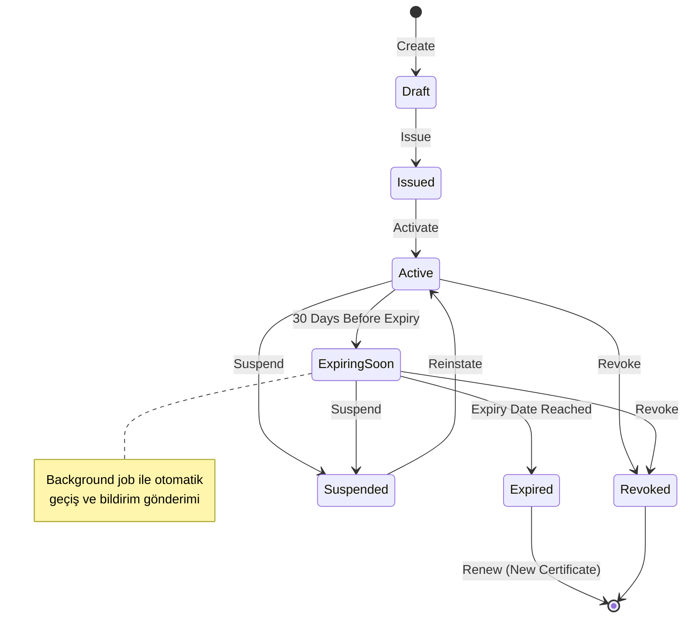

### 6.3 Aggregate: CertificateTemplate

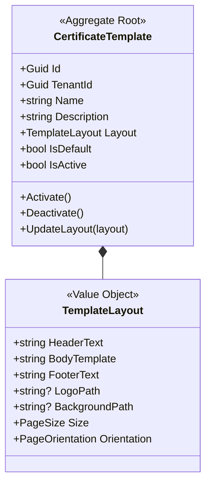

### 6.4 Domain Events — Certification Context

```csharp
public record CertificateIssued(
    Guid CertificateId, Guid EmployeeId, Guid TrainingId,
    string CertificateNumber, DateTime ExpiresAt) : DomainEvent
{
    public override string EventType => "Certification.CertificateIssued";
}

public record CertificateExpiring(
    Guid CertificateId, Guid EmployeeId,
    string CertificateNumber, DateTime ExpiresAt, 
    int DaysRemaining) : DomainEvent
{
    public override string EventType => "Certification.CertificateExpiring";
}

public record CertificateExpired(
    Guid CertificateId, Guid EmployeeId,
    string CertificateNumber) : DomainEvent
{
    public override string EventType => "Certification.CertificateExpired";
}

public record CertificateRevoked(
    Guid CertificateId, string Reason) : DomainEvent
{
    public override string EventType => "Certification.CertificateRevoked";
}
```

### 6.5 Domain Service: CertificateIssuanceService

```csharp
public interface ICertificateIssuanceService
{
    /// <summary>
    /// Eğitimi başarıyla tamamlayan çalışanlara sertifika üretir.
    /// Eğitim tipine göre geçerlilik süresi belirlenir.
    /// Sertifika numarası otomatik generate edilir.
    /// </summary>
    Task<Certificate> IssueCertificate(
        Guid employeeId, Guid trainingId, Guid? templateId = null);

    /// <summary>
    /// Toplu sertifika üretimi (bir eğitim oturumu tamamlandığında).
    /// </summary>
    Task<IReadOnlyList<Certificate>> IssueBulkCertificates(
        Guid trainingSessionId, Guid? templateId = null);

    /// <summary>
    /// Sertifika PDF'i oluşturur ve dosya yolunu döner.
    /// </summary>
    Task<string> GenerateCertificatePdf(Guid certificateId);
}
```

---

## 7. Risk Assessment Context (Phase 1)

### 7.1 Aggregate: RiskAssessment

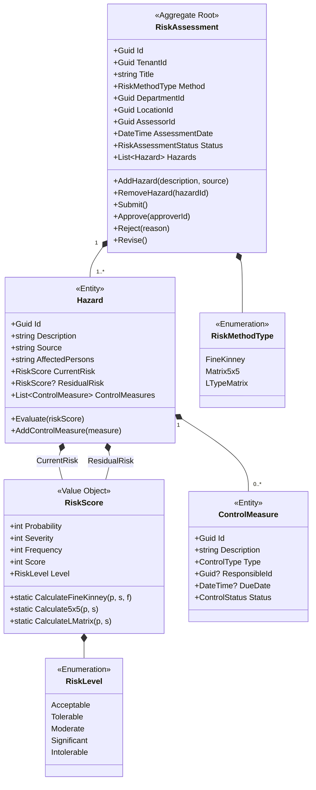

### 7.2 Fine-Kinney Value Table

```
Fine-Kinney Risk Score = Probability × Severity × Frequency

Probability (P):        Severity (S):           Frequency (F):
0.1 - Hemen hemen       1 - Dikkate değer       0.5 - Çok seyrek
      imkansız           3 - Önemli              1   - Seyrek
0.2 - Pratik olarak      7 - Ciddi               2   - Ara sıra
      imkansız          15 - Çok ciddi            3   - Sık
0.5 - Düşük             40 - Çok kötü             6   - Sürekli
  1 - Oldukça düşük    100 - Felaket
  3 - Normal
  6 - Yüksek
 10 - Çok yüksek

Risk Level:
  Score ≤ 20     → Acceptable (Kabul Edilebilir)
  20 < Score ≤ 70    → Tolerable (Olası Risk - Gözetim Gerekir)
  70 < Score ≤ 200   → Moderate (Önemli Risk)
  200 < Score ≤ 400  → Significant (Yüksek Risk)
  Score > 400        → Intolerable (Kabul Edilemez)
```

---

## 8. Incident Context (Phase 2)

### 8.1 Aggregate: Incident

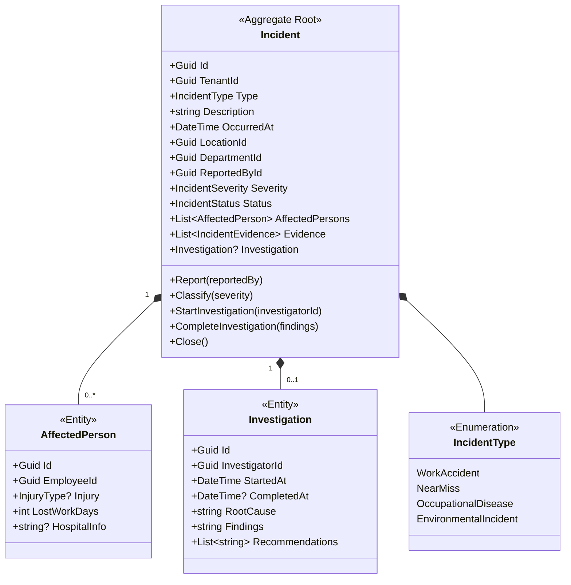

---

## 9. Notification Context

### 9.1 Aggregate: Notification

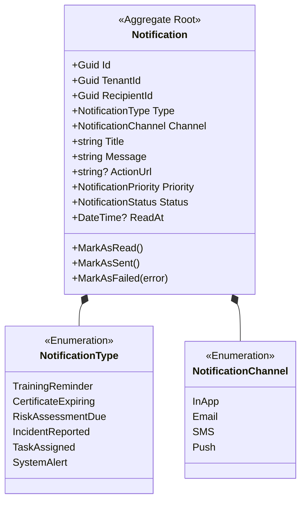

---

## 10. Domain Services Summary

| Context | Domain Service | Sorumluluk |
|---------|---------------|------------|
| **Training** | `ITrainingEligibilityService` | Çalışan eğitim uygunluk kontrolü |
| **Training** | `ITrainingSchedulingService` | Eğitim çizelgeleme, çakışma kontrolü |
| **Certification** | `ICertificateIssuanceService` | Sertifika üretimi, numara oluşturma |
| **Certification** | `ICertificateRenewalService` | Sertifika yenileme iş kuralları |
| **Risk** | `IRiskCalculationService` | Fine-Kinney, 5x5, L-Matrix hesaplama |
| **Risk** | `IRiskPrioritizationService` | Risk önceliklendirme, aksiyon önerme |
| **Incident** | `IIncidentClassificationService` | Olay sınıflandırma, SGK bildirim kuralları |
| **Notification** | `INotificationDispatchService` | Kanal seçimi, şablon render, gönderim |

---

## 11. Repository Contracts (Domain/Feature Bazlı)

Generic Repository **kullanılmayacaktır**. Her Aggregate Root için ayrı, domain-specific repository tanımlanır. EF Core yeteneklerinden (LINQ, Include, AsSplitQuery) doğrudan yararlanılır.

```csharp
// ── Training Repository ──────────────────────────────────────
public interface ITrainingRepository
{
    Task<Training?> GetByIdAsync(Guid id, CancellationToken ct = default);
    Task<Training?> GetByIdWithSessionsAsync(Guid id, CancellationToken ct = default);
    Task<Training?> GetByIdWithFullDetailsAsync(Guid id, CancellationToken ct = default);
    Task<IReadOnlyList<Training>> GetByTenantAsync(Guid tenantId, CancellationToken ct = default);
    Task<IReadOnlyList<Training>> GetUpcomingByDepartmentAsync(
        Guid tenantId, Guid departmentId, int daysAhead = 30, CancellationToken ct = default);
    Task<IReadOnlyList<Training>> SearchAsync(
        Guid tenantId, TrainingSearchCriteria criteria, CancellationToken ct = default);
    Task<bool> ExistsAsync(Guid id, CancellationToken ct = default);
    Task AddAsync(Training training, CancellationToken ct = default);
    void Update(Training training);
    void Remove(Training training);
}

// ── Certificate Repository ───────────────────────────────────
public interface ICertificateRepository
{
    Task<Certificate?> GetByIdAsync(Guid id, CancellationToken ct = default);
    Task<Certificate?> GetByNumberAsync(string certificateNumber, CancellationToken ct = default);
    Task<IReadOnlyList<Certificate>> GetByEmployeeAsync(
        Guid employeeId, CancellationToken ct = default);
    Task<IReadOnlyList<Certificate>> GetExpiringAsync(
        Guid tenantId, int daysThreshold = 30, CancellationToken ct = default);
    Task<IReadOnlyList<Certificate>> GetExpiredAsync(
        Guid tenantId, CancellationToken ct = default);
    Task AddAsync(Certificate certificate, CancellationToken ct = default);
    void Update(Certificate certificate);
}

// ── Employee Repository ──────────────────────────────────────
public interface IEmployeeRepository
{
    Task<Employee?> GetByIdAsync(Guid id, CancellationToken ct = default);
    Task<Employee?> GetByUserIdAsync(Guid userId, CancellationToken ct = default);
    Task<IReadOnlyList<Employee>> GetByDepartmentAsync(
        Guid departmentId, CancellationToken ct = default);
    Task<IReadOnlyList<Employee>> SearchAsync(
        Guid tenantId, EmployeeSearchCriteria criteria, CancellationToken ct = default);
    Task<int> CountByTenantAsync(Guid tenantId, CancellationToken ct = default);
    Task AddAsync(Employee employee, CancellationToken ct = default);
    void Update(Employee employee);
}

// ── User Repository ──────────────────────────────────────────
public interface IUserRepository
{
    Task<User?> GetByIdAsync(Guid id, CancellationToken ct = default);
    Task<User?> GetByEmailAsync(string email, CancellationToken ct = default);
    Task<User?> GetByRefreshTokenAsync(string token, CancellationToken ct = default);
    Task<IReadOnlyList<User>> GetByTenantAsync(
        Guid tenantId, CancellationToken ct = default);
    Task<bool> EmailExistsAsync(string email, CancellationToken ct = default);
    Task AddAsync(User user, CancellationToken ct = default);
    void Update(User user);
}

// ── Unit of Work ─────────────────────────────────────────────
public interface IUnitOfWork
{
    Task<int> SaveChangesAsync(CancellationToken ct = default);
}
```

---

## 12. Domain Event Flow — End-to-End

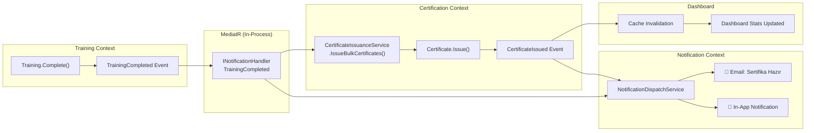

---

## Açık Sorular

| # | Soru | Etki |
|---|------|------|
| 1 | Flutter state management olarak **Riverpod** mı yoksa **Bloc** mu tercih edilecek? | Repository Layer yapısı |
| 2 | Multi-tenant yapı: **Schema-per-tenant** mı yoksa **Row-Level Security** mi? | Company Aggregate, DB tasarımı |
| 3 | Eğitim tipleri ve kategorileri Türk İSG mevzuatına göre sabit mi olmalı, yoksa tenant bazlı özelleştirilebilir mi? | Training Aggregate, Rule Engine |
| 4 | Sertifika numarası formatı için tercih var mı? (Örn: `SF-2026-00001`) | CertificateNumber Value Object |
