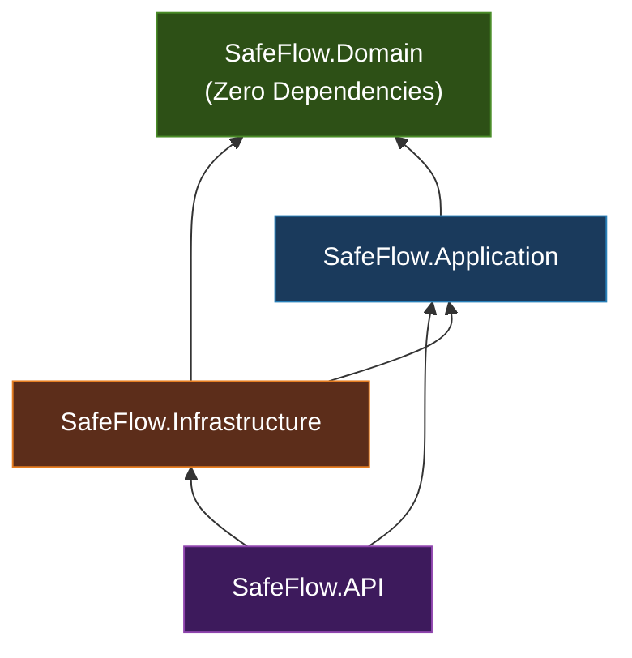
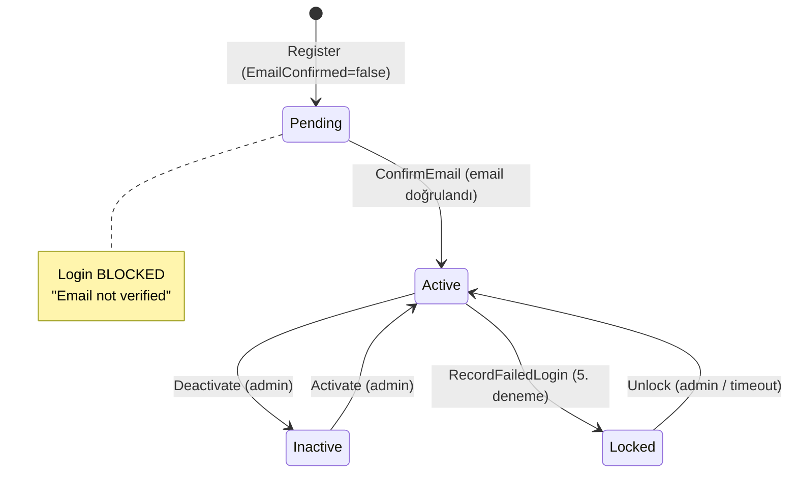
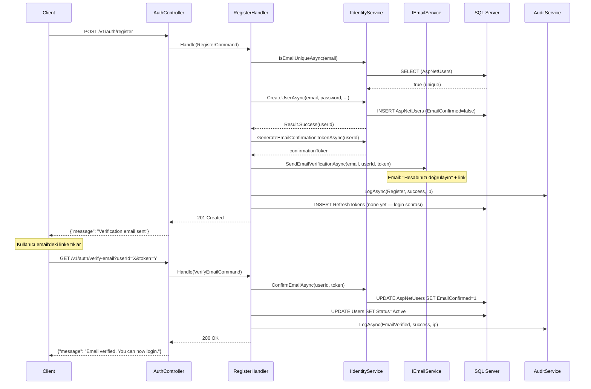
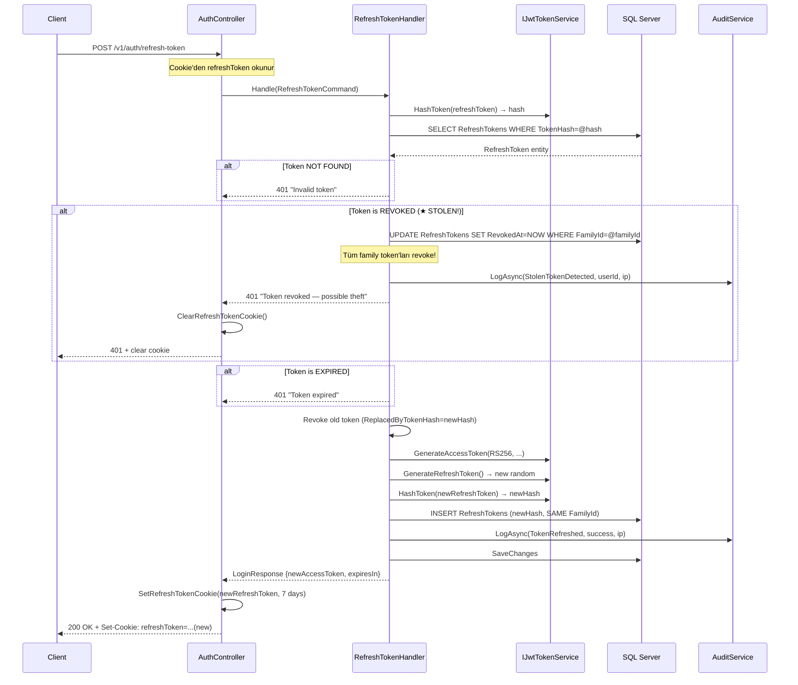

# SafeFlow-AI — Identity Module Architecture Design

> **Versiyon:** 3.0  
> **Tarih:** 2026-07-13  
> **Durum:** ✅ Onaylandı  
> **Yazar:** Senior Enterprise .NET Architect  
> **Kapsam:** Identity & Authentication Module — Clean Architecture + Microsoft Identity

---

## 0. Mimari Kararlar Özeti (Onaylandı)

| # | Karar | Sonuç | Gerekçe |
|---|-------|-------|---------|
| 1 | **User & Token Storage** | Ayrı tablolar | ASP.NET Identity tabloları dokunulmaz. `RefreshTokens` ayrı tablo. Kullanıcı başına çoklu aktif oturum. Yalnızca SHA256 hash saklanır. |
| 2 | **JWT Signing** | **RS256** (asymmetric) | Private key sunucuda kalır. Public key ileride mikroservislere dağıtılabilir. Ölçeklenebilirlik için tasarlandı. |
| 3 | **Refresh Token Delivery** | **HttpOnly + Secure + SameSite=Strict cookie** | LocalStorage'da ASLA saklanmaz. DB'de yalnızca SHA256 hash. Token rotation + family-based reuse detection. |
| 4 | **Password Hashing** | **PBKDF2** (Identity default) v1 | `IPasswordHasher<T>` soyutlaması korunur. Argon2id ileride application katmanı değişmeden eklenebilir. |
| 5 | **Email Verification** | **MVP'de zorunlu** | Kullanıcılar email doğrulamadan login yapamaz. Microsoft Identity email confirmation token'ları kullanılır. |

---

## 1. Sprint Kapsamı

### Sprint 1 — Identity Core (Bu doküman)

| # | Özellik | Durum | Açıklama |
|---|---------|-------|----------|
| 1 | Register | ✅ Tam impl. | Kullanıcı kaydı + tenant oluşturma |
| 2 | Email Verification | ✅ Tam impl. | Zorunlu email doğrulama, Identity token'ları |
| 3 | Login | ✅ Tam impl. | JWT + Refresh Token (HttpOnly cookie) |
| 4 | Refresh Token | ✅ Tam impl. | Rotation + family-based stolen detection |
| 5 | Logout | ✅ Tam impl. | Token revocation + cookie silme |
| 6 | Forgot Password | ✅ Tam impl. | Reset token üretimi + email gönderimi |
| 7 | Reset Password | ✅ Tam impl. | Token doğrulama + parola değiştirme |
| 8 | Change Password | ✅ Tam impl. | Mevcut parola doğrulama + yenileme |
| 9 | Lockout | ✅ Tam impl. | 5 başarısız deneme → otomatik kilit |
| 10 | Audit Log | ✅ Tam impl. | Tüm auth işlemleri loglanır |
| 11 | `GET /auth/me` | ✅ Tam impl. | Mevcut kullanıcı profili |

### Sprint 2 — Identity Management (Ertelendi)

| # | Özellik | Durum | Sprint 1'de |
|---|---------|-------|-------------|
| 1 | Role Management CRUD | ⏳ Sprint 2 | Yalnızca `IRoleRepository` interface |
| 2 | Permission Management | ⏳ Sprint 2 | Yalnızca `Permissions` constants |
| 3 | User Management CRUD | ⏳ Sprint 2 | Yalnızca `IUserRepository` interface |
| 4 | `[HasPermission]` Authorization | ⏳ Sprint 2 | Yalnızca interface tanımı |
| 5 | Company/Tenant Management | ⏳ Sprint 2 | Yalnızca `ITenantService` interface |

> [!IMPORTANT]
> Sprint 2'ye ertelenen özellikler Sprint 1'de **interface seviyesinde** tanımlanır.
> Domain entity'leri (Role, Permission) Sprint 1'de oluşturulur ancak CRUD endpoint'leri Sprint 2'de implemente edilir.
> Sprint 1'de kullanıcılar seed data ile oluşturulan varsayılan rollere atanır.

---

## 2. Mimari Karar Kaydı (ADR)

### ADR-001: Microsoft Identity + Clean Architecture Entegrasyon Stratejisi

**Bağlam:** Microsoft Identity kullanımı zorunlu. Clean Architecture'ın "Domain katmanı hiçbir infrastructure'a bağımlı olmaz" prensibi korunmalı.

**Karar:** **Pragmatic Isolation** stratejisi:

```
┌──────────────────────────────────────────────────────────────────┐
│                        KATMAN SORUMLULUKLARI                      │
├──────────────────────────────────────────────────────────────────┤
│  Domain Layer          │ User Aggregate Root (pure POCO)          │
│                        │ Value Objects, Domain Events              │
│                        │ Repository interfaces                     │
│                        │ ❌ Microsoft.Identity bağımlılığı YOK     │
├────────────────────────┼──────────────────────────────────────────┤
│  Application Layer     │ IIdentityService interface                │
│                        │ CQRS Commands/Queries/Handlers            │
│                        │ FluentValidation validators               │
│                        │ ❌ Microsoft.Identity bağımlılığı YOK     │
├────────────────────────┼──────────────────────────────────────────┤
│  Infrastructure Layer  │ ApplicationUser : IdentityUser<Guid>      │
│                        │ ApplicationRole : IdentityRole<Guid>      │
│                        │ IdentityService : IIdentityService        │
│                        │ JwtTokenService : IJwtTokenService        │
│                        │ UserManager, SignInManager kullanımı       │
│                        │ ✅ Microsoft.Identity bağımlılığı BURADA  │
├────────────────────────┼──────────────────────────────────────────┤
│  API/Presentation      │ AuthController, middleware, cookie mgmt   │
│                        │ Permission-based authorization             │
└────────────────────────┴──────────────────────────────────────────┘
```

**Gerekçe:**
1. Domain katmanı saf kalır — Unit test'ler infrastructure'a bağımlı olmaz
2. Identity servisleri swap edilebilir (gelecekte Keycloak, Auth0)
3. Microsoft Identity'nin güvenlik avantajları kullanılır
4. `IPasswordHasher<ApplicationUser>` soyutlaması Argon2id geçişini mümkün kılar

---

### ADR-002: ASP.NET Core 9 + SQL Server

| Karar | Değer |
|-------|-------|
| **Runtime** | .NET 9 / ASP.NET Core 9 |
| **Database** | SQL Server 2022 |
| **ORM** | EF Core 9 + Microsoft.EntityFrameworkCore.SqlServer |
| **Identity** | Microsoft.AspNetCore.Identity.EntityFrameworkCore |
| **SDK Sabitleme** | `global.json` → `"version": "9.0.xxx"` |

---

### ADR-003: Tablo Stratejisi — Ayrı Tablolar

**Karar:** ASP.NET Identity tabloları dokunulmaz. Domain verileri ayrı tablolarda.

```
┌─────────────────────────────────────────────────────────────────┐
│                      TABLO MİMARİSİ                              │
├─────────────────────────────────────────────────────────────────┤
│                                                                   │
│  ASP.NET Identity Tabloları (DOKUNULMAZ)                         │
│  ├── AspNetUsers           → IdentityUser<Guid> + ek alanlar    │
│  ├── AspNetRoles           → IdentityRole<Guid>                  │
│  ├── AspNetUserRoles       → Join tablosu                        │
│  ├── AspNetUserClaims      → Kullanıcı claim'leri               │
│  ├── AspNetRoleClaims      → Rol claim'leri                      │
│  ├── AspNetUserLogins      → External login (SSO hazırlık)       │
│  └── AspNetUserTokens      → 2FA, email confirm token vb.       │
│                                                                   │
│  SafeFlow Domain Tabloları (AYRI)                                │
│  ├── RefreshTokens         → ★ Ayrı tablo, UserId FK            │
│  ├── AuditLogs             → Tüm auth işlemleri                  │
│  └── (Sprint 2: Roles, RolePermissions, UserRoles)               │
│                                                                   │
│  İLİŞKİ                                                         │
│  AspNetUsers.Id ──FK──→ RefreshTokens.UserId                     │
│  AspNetUsers.Id ──FK──→ AuditLogs.UserId                         │
│  Bir kullanıcının ÇOKLU aktif RefreshToken'ı olabilir            │
│  (farklı cihazlar = farklı oturumlar)                            │
│                                                                   │
└─────────────────────────────────────────────────────────────────┘
```

**Gerekçe:**
- Identity tabloları UserManager/SignInManager tarafından otomatik yönetilir
- Dokunmak migration çakışmaları ve upgrade sorunları yaratır
- RefreshToken domain'e özgü bir kavram — Identity'nin token store'undan bağımsız
- Çoklu aktif oturum desteği (mobil + web + tablet)

---

### ADR-004: RS256 Token Stratejisi

```
┌─────────────────────────────────────────────────────────────────┐
│                     TOKEN STRATEJİSİ (RS256)                     │
├─────────────────────────────────────────────────────────────────┤
│                                                                   │
│  Access Token (JWT — RS256)                                       │
│  ├── Algorithm: RS256 (RSA-SHA256, asymmetric)                   │
│  ├── Key Pair:                                                    │
│  │   ├── Private Key → sunucuda kalır (token imzalama)           │
│  │   ├── Public Key → dağıtılabilir (token doğrulama)            │
│  │   └── Key Size: 2048 bit minimum                              │
│  ├── Lifetime: 15 dakika                                         │
│  ├── Claims: sub, email, name, tenant_id, roles, permissions     │
│  ├── Storage: Client memory only (SPA) / Secure Storage (mobil)  │
│  └── Validation: Signature + Expiry + Issuer + Audience          │
│                                                                   │
│  Refresh Token                                                    │
│  ├── Format: Cryptographic random (64 bytes → Base64)            │
│  ├── Lifetime: 7 gün (configurable)                              │
│  ├── DB Storage: Yalnızca SHA256 hash (plain ASLA saklanmaz)     │
│  ├── Client Delivery: HttpOnly + Secure + SameSite=Strict cookie │
│  ├── ASLA LocalStorage'da saklanmaz                              │
│  ├── Rotation: Her kullanımda yeni token üretilir                │
│  ├── Family Tracking: Token ailesi ile stolen token detection     │
│  ├── Multi-Session: Kullanıcı başına çoklu aktif token            │
│  └── Revocation: Logout, password change, admin action            │
│                                                                   │
│  RS256 Avantajları                                                │
│  ├── Mikroservis ölçeklenmesi: Public key ile herkes doğrulayabilir│
│  ├── Anahtar rotasyonu: JWKS endpoint ile otomatik                │
│  ├── Güvenlik: Private key hiçbir zaman ağ üzerinde paylaşılmaz  │
│  └── Standart: OAuth 2.0 / OpenID Connect uyumlu                 │
│                                                                   │
└─────────────────────────────────────────────────────────────────┘
```

---

### ADR-005: HttpOnly Cookie Refresh Token Delivery

```
┌─────────────────────────────────────────────────────────────────┐
│               REFRESH TOKEN COOKIE STRATEJİSİ                    │
├─────────────────────────────────────────────────────────────────┤
│                                                                   │
│  Set-Cookie Header (Login / Refresh Response)                     │
│  ┌─────────────────────────────────────────────────────────────┐ │
│  │ Set-Cookie: refreshToken=<token>;                           │ │
│  │   HttpOnly;        ← JavaScript erişimi yok (XSS koruması) │ │
│  │   Secure;          ← Yalnızca HTTPS üzerinden gönderilir   │ │
│  │   SameSite=Strict; ← CSRF koruması (cross-origin gönderilmez)│ │
│  │   Path=/v1/auth;   ← Yalnızca auth endpoint'lerine gönderilir│ │
│  │   Max-Age=604800;  ← 7 gün (saniye cinsinden)              │ │
│  └─────────────────────────────────────────────────────────────┘ │
│                                                                   │
│  Logout Response                                                  │
│  ┌─────────────────────────────────────────────────────────────┐ │
│  │ Set-Cookie: refreshToken=;                                  │ │
│  │   HttpOnly; Secure; SameSite=Strict;                        │ │
│  │   Path=/v1/auth;                                            │ │
│  │   Max-Age=0;       ← Cookie hemen silinir                  │ │
│  └─────────────────────────────────────────────────────────────┘ │
│                                                                   │
│  Client Tarafı                                                    │
│  ├── Access Token: Memory'de tutulur (JavaScript erişebilir)      │
│  ├── Refresh Token: Cookie'de (JavaScript erişemez)               │
│  ├── Token refresh: Browser cookie'yi otomatik gönderir           │
│  └── Logout: API çağrısı + cookie silinir                        │
│                                                                   │
│  Mobil Uygulama (Flutter) İstisnası                               │
│  ├── Mobil tarayıcıda cookie çalışmaz                            │
│  ├── Refresh token response body'de de döner                     │
│  ├── Flutter: flutter_secure_storage ile saklanır                 │
│  └── API Header: Authorization: Bearer <AT>                      │
│       + X-Refresh-Token: <RT> (cookie yoksa fallback)            │
│                                                                   │
└─────────────────────────────────────────────────────────────────┘
```

---

### ADR-006: Password Hashing Soyutlaması

```csharp
// Microsoft Identity'nin IPasswordHasher<T> zaten bir soyutlamadır.
// v1'de Identity default (PBKDF2) kullanılır.
// Argon2id geçişi için yalnızca Infrastructure'da bir sınıf swap edilir.

// v1 — Identity Default (PBKDF2)
// DI: services.AddIdentity<ApplicationUser, ApplicationRole>()
//     → otomatik olarak PasswordHasher<ApplicationUser> kaydeder

// v2 (Gelecek) — Argon2id
// services.AddScoped<IPasswordHasher<ApplicationUser>, Argon2idPasswordHasher>();
// Application katmanı DEĞİŞMEZ.
```

---

### ADR-007: Email Verification (MVP Zorunlu)

```
┌─────────────────────────────────────────────────────────────────┐
│              EMAIL VERIFICATION AKIŞI (MVP)                      │
├─────────────────────────────────────────────────────────────────┤
│                                                                   │
│  1. Register                                                      │
│     ├── User oluşturulur (Status: Pending, EmailConfirmed: false)│
│     ├── Identity email confirmation token üretilir               │
│     │   → UserManager.GenerateEmailConfirmationTokenAsync()      │
│     ├── Token + UserId ile verification URL oluşturulur          │
│     │   → https://app.safeflow.ai/verify-email?userId=X&token=Y │
│     ├── IEmailService.SendEmailVerificationAsync() çağrılır      │
│     └── Response: 201 Created (token döndürülmez)                │
│                                                                   │
│  2. Email Verification                                            │
│     ├── GET /v1/auth/verify-email?userId=X&token=Y               │
│     ├── UserManager.ConfirmEmailAsync(user, token) çağrılır      │
│     ├── Başarılı → EmailConfirmed = true                         │
│     ├── Domain: user.Activate() → Status: Pending → Active      │
│     ├── UserActivatedDomainEvent dispatched                       │
│     └── Response: 200 OK                                          │
│                                                                   │
│  3. Login (Email Kontrolü)                                        │
│     ├── EmailConfirmed == false → 403 Forbidden                  │
│     │   "Email adresiniz doğrulanmamış. Lütfen e-postanızı       │
│     │    kontrol edin veya yeni doğrulama linki isteyin."        │
│     └── EmailConfirmed == true → normal login akışı              │
│                                                                   │
│  4. Resend Verification Email                                     │
│     ├── POST /v1/auth/resend-verification                        │
│     ├── Rate limit: 3 dakikada 1 kez                             │
│     ├── Yeni token üretilir, eski geçersiz                       │
│     └── Response: 200 OK (her zaman, güvenlik)                    │
│                                                                   │
│  Token Detayları                                                  │
│  ├── Microsoft Identity DataProtectorTokenProvider kullanılır     │
│  ├── Token ömrü: 24 saat (configurable)                          │
│  ├── Token tek kullanımlık                                        │
│  └── SecurityStamp değişirse tüm token'lar geçersiz             │
│                                                                   │
└─────────────────────────────────────────────────────────────────┘
```

---

## 3. Proje Yapısı ve Solution Organizasyonu

```
SafeFlow.sln
│
├── src/
│   ├── SafeFlow.Domain/                          # Domain Layer (Core)
│   │   ├── SafeFlow.Domain.csproj
│   │   │
│   │   ├── Common/                                # Shared Kernel
│   │   │   ├── BaseEntity.cs
│   │   │   ├── AggregateRoot.cs
│   │   │   ├── ValueObject.cs
│   │   │   ├── Enumeration.cs
│   │   │   ├── IDomainEvent.cs
│   │   │   ├── DomainEvent.cs
│   │   │   ├── ITenantEntity.cs
│   │   │   ├── IAuditableEntity.cs
│   │   │   └── DomainException.cs
│   │   │
│   │   └── Identity/                              # Identity Bounded Context
│   │       ├── Entities/
│   │       │   ├── User.cs                        # Aggregate Root
│   │       │   ├── RefreshToken.cs                # Entity (ayrı tablo)
│   │       │   ├── Role.cs                        # Aggregate Root (Sprint 1: entity only)
│   │       │   ├── RolePermission.cs              # Entity (Sprint 1: entity only)
│   │       │   └── AuditLog.cs                    # Entity
│   │       │
│   │       ├── ValueObjects/
│   │       │   ├── Email.cs
│   │       │   ├── FullName.cs
│   │       │   ├── PhoneNumber.cs
│   │       │   └── Permission.cs
│   │       │
│   │       ├── Enums/
│   │       │   ├── UserStatus.cs                  # Pending, Active, Inactive, Locked
│   │       │   └── AuditAction.cs                 # Register, Login, LoginFailed, ...
│   │       │
│   │       ├── Events/
│   │       │   ├── UserRegisteredDomainEvent.cs
│   │       │   ├── UserActivatedDomainEvent.cs     # ★ Email verification sonrası
│   │       │   ├── UserLockedDomainEvent.cs
│   │       │   ├── UserDeactivatedDomainEvent.cs
│   │       │   ├── RoleAssignedDomainEvent.cs
│   │       │   ├── RoleRemovedDomainEvent.cs
│   │       │   ├── RefreshTokenRotatedDomainEvent.cs
│   │       │   ├── RefreshTokenRevokedDomainEvent.cs
│   │       │   ├── PasswordChangedDomainEvent.cs
│   │       │   ├── PasswordResetRequestedDomainEvent.cs
│   │       │   └── EmailVerificationSentDomainEvent.cs  # ★ Yeni
│   │       │
│   │       ├── Repositories/
│   │       │   ├── IUserRepository.cs             # ★ Sprint 1: interface tanımı
│   │       │   ├── IRoleRepository.cs             # ★ Sprint 1: interface only
│   │       │   └── IAuditLogRepository.cs
│   │       │
│   │       ├── Constants/
│   │       │   ├── Permissions.cs                 # Sprint 1: constants tanımı
│   │       │   └── DefaultRoles.cs                # Sprint 1: constants tanımı
│   │       │
│   │       └── Errors/
│   │           └── IdentityErrors.cs
│   │
│   ├── SafeFlow.Application/                      # Application Layer
│   │   ├── SafeFlow.Application.csproj
│   │   │
│   │   ├── Common/
│   │   │   ├── Interfaces/
│   │   │   │   ├── IIdentityService.cs            # ★ Identity operations contract
│   │   │   │   ├── IJwtTokenService.cs            # ★ Token generation contract
│   │   │   │   ├── ICurrentUserService.cs
│   │   │   │   ├── IEmailService.cs
│   │   │   │   ├── ICacheService.cs
│   │   │   │   ├── IUnitOfWork.cs
│   │   │   │   ├── IDateTimeProvider.cs
│   │   │   │   ├── ITenantService.cs              # Sprint 1: interface only
│   │   │   │   └── IAuditService.cs               # ★ Audit log soyutlaması
│   │   │   │
│   │   │   ├── CQRS/
│   │   │   │   ├── ICommand.cs
│   │   │   │   ├── IQuery.cs
│   │   │   │   ├── ICommandHandler.cs
│   │   │   │   └── IQueryHandler.cs
│   │   │   │
│   │   │   ├── Results/
│   │   │   │   ├── Result.cs
│   │   │   │   ├── Result{T}.cs
│   │   │   │   ├── Error.cs
│   │   │   │   └── PagedResult{T}.cs
│   │   │   │
│   │   │   └── Behaviors/
│   │   │       ├── LoggingBehavior.cs
│   │   │       ├── ValidationBehavior.cs
│   │   │       ├── PerformanceBehavior.cs
│   │   │       └── UnhandledExceptionBehavior.cs
│   │   │
│   │   └── Identity/
│   │       ├── Commands/                          # ★ Sprint 1: Tam implementasyon
│   │       │   ├── Register/
│   │       │   │   ├── RegisterCommand.cs
│   │       │   │   ├── RegisterCommandHandler.cs
│   │       │   │   └── RegisterCommandValidator.cs
│   │       │   │
│   │       │   ├── VerifyEmail/                    # ★ YENİ
│   │       │   │   ├── VerifyEmailCommand.cs
│   │       │   │   └── VerifyEmailCommandHandler.cs
│   │       │   │
│   │       │   ├── ResendVerification/             # ★ YENİ
│   │       │   │   ├── ResendVerificationCommand.cs
│   │       │   │   ├── ResendVerificationCommandHandler.cs
│   │       │   │   └── ResendVerificationCommandValidator.cs
│   │       │   │
│   │       │   ├── Login/
│   │       │   │   ├── LoginCommand.cs
│   │       │   │   ├── LoginCommandHandler.cs
│   │       │   │   └── LoginCommandValidator.cs
│   │       │   │
│   │       │   ├── RefreshToken/
│   │       │   │   ├── RefreshTokenCommand.cs
│   │       │   │   └── RefreshTokenCommandHandler.cs
│   │       │   │
│   │       │   ├── RevokeToken/
│   │       │   │   ├── RevokeTokenCommand.cs
│   │       │   │   └── RevokeTokenCommandHandler.cs
│   │       │   │
│   │       │   ├── ForgotPassword/
│   │       │   │   ├── ForgotPasswordCommand.cs
│   │       │   │   ├── ForgotPasswordCommandHandler.cs
│   │       │   │   └── ForgotPasswordCommandValidator.cs
│   │       │   │
│   │       │   ├── ResetPassword/
│   │       │   │   ├── ResetPasswordCommand.cs
│   │       │   │   ├── ResetPasswordCommandHandler.cs
│   │       │   │   └── ResetPasswordCommandValidator.cs
│   │       │   │
│   │       │   └── ChangePassword/
│   │       │       ├── ChangePasswordCommand.cs
│   │       │       ├── ChangePasswordCommandHandler.cs
│   │       │       └── ChangePasswordCommandValidator.cs
│   │       │
│   │       ├── Queries/                           # ★ Sprint 1: Yalnızca GetCurrentUser
│   │       │   └── GetCurrentUser/
│   │       │       ├── GetCurrentUserQuery.cs
│   │       │       ├── GetCurrentUserQueryHandler.cs
│   │       │       └── CurrentUserResponse.cs
│   │       │
│   │       ├── DTOs/
│   │       │   ├── AuthTokenResponse.cs
│   │       │   ├── LoginResponse.cs               # AccessToken + UserInfo (RT cookie'de)
│   │       │   ├── RegisterResponse.cs
│   │       │   └── UserInfoDto.cs
│   │       │
│   │       └── EventHandlers/
│   │           ├── UserRegisteredSendVerificationHandler.cs  # ★ Email gönder
│   │           ├── UserLockedNotificationHandler.cs
│   │           └── PasswordChangedRevokeTokensHandler.cs
│   │
│   ├── SafeFlow.Infrastructure/                   # Infrastructure Layer
│   │   ├── SafeFlow.Infrastructure.csproj
│   │   │
│   │   ├── Identity/
│   │   │   ├── Entities/
│   │   │   │   ├── ApplicationUser.cs             # ★ : IdentityUser<Guid>
│   │   │   │   └── ApplicationRole.cs             # ★ : IdentityRole<Guid>
│   │   │   │
│   │   │   └── Services/
│   │   │       ├── IdentityService.cs             # ★ IIdentityService impl
│   │   │       └── CurrentUserService.cs
│   │   │
│   │   ├── Authentication/
│   │   │   ├── JwtTokenService.cs                 # ★ RS256 impl
│   │   │   ├── JwtSettings.cs
│   │   │   └── RsaKeyService.cs                   # ★ RSA key pair yönetimi
│   │   │
│   │   ├── Persistence/
│   │   │   ├── SafeFlowDbContext.cs               # ★ : IdentityDbContext
│   │   │   ├── UnitOfWork.cs
│   │   │   │
│   │   │   ├── Configurations/
│   │   │   │   ├── RefreshTokenConfiguration.cs   # ★ Ayrı tablo
│   │   │   │   ├── AuditLogConfiguration.cs
│   │   │   │   ├── ApplicationUserConfiguration.cs # Identity tablo ek alanları
│   │   │   │   ├── RoleConfiguration.cs           # Sprint 1: config only
│   │   │   │   └── RolePermissionConfiguration.cs # Sprint 1: config only
│   │   │   │
│   │   │   ├── Repositories/
│   │   │   │   ├── UserRepository.cs
│   │   │   │   ├── RoleRepository.cs              # Sprint 1: temel metotlar only
│   │   │   │   └── AuditLogRepository.cs
│   │   │   │
│   │   │   ├── Seeds/
│   │   │   │   └── IdentitySeedData.cs            # Varsayılan roller + admin user
│   │   │   │
│   │   │   └── Interceptors/
│   │   │       ├── AuditableEntityInterceptor.cs
│   │   │       └── DomainEventDispatcherInterceptor.cs
│   │   │
│   │   ├── Email/
│   │   │   ├── SmtpEmailService.cs                # IEmailService impl
│   │   │   └── EmailSettings.cs
│   │   │
│   │   ├── Auditing/
│   │   │   └── AuditService.cs                    # IAuditService impl
│   │   │
│   │   ├── Caching/
│   │   │   └── MemoryCacheService.cs
│   │   │
│   │   └── DependencyInjection.cs
│   │
│   └── SafeFlow.API/                             # Presentation Layer
│       ├── SafeFlow.API.csproj
│       │
│       ├── Controllers/
│       │   └── AuthController.cs                  # ★ Sprint 1: Tüm auth endpoint'leri
│       │
│       ├── Middleware/
│       │   ├── CorrelationIdMiddleware.cs
│       │   ├── GlobalExceptionHandlerMiddleware.cs
│       │   └── RequestLoggingMiddleware.cs
│       │
│       ├── Extensions/
│       │   └── CookieExtensions.cs                # ★ Refresh token cookie yönetimi
│       │
│       ├── Common/
│       │   ├── BaseApiController.cs
│       │   └── ApiResponse.cs
│       │
│       └── Program.cs
│
├── tests/
│   ├── SafeFlow.Domain.Tests/
│   │   └── Identity/
│   │       ├── UserTests.cs
│   │       ├── RefreshTokenTests.cs
│   │       └── ValueObjects/
│   │           ├── EmailTests.cs
│   │           ├── FullNameTests.cs
│   │           └── PhoneNumberTests.cs
│   │
│   ├── SafeFlow.Application.Tests/
│   │   └── Identity/
│   │       ├── Commands/
│   │       │   ├── RegisterCommandHandlerTests.cs
│   │       │   ├── LoginCommandHandlerTests.cs
│   │       │   ├── VerifyEmailCommandHandlerTests.cs
│   │       │   └── RefreshTokenCommandHandlerTests.cs
│   │       └── Validators/
│   │           ├── RegisterCommandValidatorTests.cs
│   │           └── LoginCommandValidatorTests.cs
│   │
│   ├── SafeFlow.Infrastructure.Tests/
│   │   └── Identity/
│   │       ├── IdentityServiceTests.cs
│   │       └── JwtTokenServiceTests.cs
│   │
│   └── SafeFlow.API.Tests/
│       └── Controllers/
│           └── AuthControllerTests.cs
│
├── keys/                                          # ★ RSA key pair (gitignore!)
│   ├── rsa_private.pem
│   └── rsa_public.pem
│
├── global.json
├── Directory.Build.props
├── .editorconfig
├── .gitignore
├── docker-compose.yml
└── README.md
```

---

## 4. Proje Referansları ve NuGet Paketleri

### Bağımlılık Yönü


### NuGet Paketleri

**SafeFlow.Domain** — Saf, bağımlılık yok
```xml
<PackageReference Include="MediatR.Contracts" Version="2.*" />
```

**SafeFlow.Application**
```xml
<PackageReference Include="MediatR" Version="12.*" />
<PackageReference Include="FluentValidation" Version="11.*" />
<PackageReference Include="FluentValidation.DependencyInjectionExtensions" Version="11.*" />
<PackageReference Include="Microsoft.Extensions.Logging.Abstractions" Version="9.*" />
```

**SafeFlow.Infrastructure**
```xml
<!-- Identity + EF Core -->
<PackageReference Include="Microsoft.AspNetCore.Identity.EntityFrameworkCore" Version="9.*" />
<PackageReference Include="Microsoft.EntityFrameworkCore.SqlServer" Version="9.*" />
<PackageReference Include="Microsoft.EntityFrameworkCore.Tools" Version="9.*" />

<!-- JWT RS256 -->
<PackageReference Include="Microsoft.AspNetCore.Authentication.JwtBearer" Version="9.*" />
<PackageReference Include="System.IdentityModel.Tokens.Jwt" Version="8.*" />

<!-- Email -->
<PackageReference Include="MailKit" Version="4.*" />

<!-- Logging -->
<PackageReference Include="Serilog.AspNetCore" Version="9.*" />
<PackageReference Include="Serilog.Sinks.Console" Version="6.*" />
```

**SafeFlow.API**
```xml
<PackageReference Include="Swashbuckle.AspNetCore" Version="7.*" />
```

---

## 5. Domain Layer — Entity Tasarımı

### 5.1 User Aggregate Root

```csharp
public sealed class User : AggregateRoot, ITenantEntity, IAuditableEntity
{
    // ── Properties ──
    public Email Email { get; private set; }
    public FullName FullName { get; private set; }
    public PhoneNumber? PhoneNumber { get; private set; }
    public UserStatus Status { get; private set; }
    public Guid TenantId { get; private set; }
    public bool EmailConfirmed { get; private set; }       // ★ Email verification
    public DateTime? LastLoginAt { get; private set; }
    public int FailedLoginAttempts { get; private set; }
    public DateTime? LockoutEnd { get; private set; }

    // ── Factory ──
    public static User Create(Email email, FullName fullName, Guid tenantId, PhoneNumber? phone = null);
    // Status = Pending, EmailConfirmed = false

    // ── Domain Behaviors ──
    public void Activate();                          // Pending → Active (email verified)
    public void Deactivate(string deactivatedBy);    // Active → Inactive
    public void Lock(string reason);                 // Any → Locked
    public void Unlock();                            // Locked → Active
    public void ConfirmEmail();                      // ★ EmailConfirmed = true + Activate
    public void RecordSuccessfulLogin();
    public void RecordFailedLogin(int maxAttempts);  // Auto-lock at max
    public void UpdateProfile(FullName name, PhoneNumber? phone);

    // ── Role Management (Sprint 1: interface, Sprint 2: full impl) ──
    public void AssignRole(Guid roleId, string assignedBy);
    public void RemoveRole(Guid roleId);
}
```

**State Machine (Email Verification dahil):**


---

### 5.2 RefreshToken Entity (Ayrı Tablo)

```csharp
public sealed class RefreshToken : BaseEntity
{
    public Guid UserId { get; private set; }
    public string TokenHash { get; private set; }          // ★ Yalnızca SHA256 hash
    public DateTime ExpiresAt { get; private set; }
    public DateTime CreatedAt { get; private set; }
    public string CreatedByIp { get; private set; }
    public string? UserAgent { get; private set; }
    public DateTime? RevokedAt { get; private set; }
    public string? RevokedByIp { get; private set; }
    public string? RevokedReason { get; private set; }
    public string? ReplacedByTokenHash { get; private set; }
    public string FamilyId { get; private set; }           // ★ Stolen token detection

    // ── Computed ──
    public bool IsExpired => DateTime.UtcNow >= ExpiresAt;
    public bool IsRevoked => RevokedAt.HasValue;
    public bool IsActive => !IsRevoked && !IsExpired;

    // ── Factory ──
    public static RefreshToken Create(
        Guid userId, string tokenHash, DateTime expiresAt,
        string ipAddress, string? userAgent, string? familyId = null);

    // ── Behaviors ──
    public void Revoke(string ipAddress, string? reason = null, string? replacedByTokenHash = null);
}
```

**RefreshTokens Tablo Şeması:**
```sql
CREATE TABLE [dbo].[RefreshTokens] (
    [Id]                   UNIQUEIDENTIFIER NOT NULL PRIMARY KEY,
    [UserId]               UNIQUEIDENTIFIER NOT NULL,   -- FK → AspNetUsers.Id
    [TokenHash]            NVARCHAR(128)    NOT NULL,   -- SHA256 hash
    [ExpiresAt]            DATETIME2        NOT NULL,
    [CreatedAt]            DATETIME2        NOT NULL,
    [CreatedByIp]          NVARCHAR(50)     NOT NULL,
    [UserAgent]            NVARCHAR(500)    NULL,
    [RevokedAt]            DATETIME2        NULL,
    [RevokedByIp]          NVARCHAR(50)     NULL,
    [RevokedReason]        NVARCHAR(200)    NULL,
    [ReplacedByTokenHash]  NVARCHAR(128)    NULL,
    [FamilyId]             NVARCHAR(64)     NOT NULL,   -- Token family

    CONSTRAINT [FK_RefreshTokens_AspNetUsers]
        FOREIGN KEY ([UserId]) REFERENCES [AspNetUsers]([Id])
        ON DELETE CASCADE,

    INDEX [IX_RefreshTokens_TokenHash]  NONCLUSTERED ([TokenHash]),
    INDEX [IX_RefreshTokens_UserId]     NONCLUSTERED ([UserId]),
    INDEX [IX_RefreshTokens_FamilyId]   NONCLUSTERED ([FamilyId])
);
```

---

### 5.3 AuditLog Entity

```csharp
public sealed class AuditLog : BaseEntity
{
    public Guid? UserId { get; private set; }
    public string? Email { get; private set; }
    public AuditAction Action { get; private set; }
    public bool IsSuccess { get; private set; }
    public string? FailureReason { get; private set; }
    public string IpAddress { get; private set; }
    public string? UserAgent { get; private set; }
    public DateTime OccurredAt { get; private set; }
    public string? AdditionalData { get; private set; }    // JSON

    public static AuditLog Create(AuditAction action, bool isSuccess, string ipAddress, ...);
}

public enum AuditAction
{
    Register,
    EmailVerificationSent,
    EmailVerified,
    Login,
    LoginFailed,
    Logout,
    TokenRefreshed,
    StolenTokenDetected,
    PasswordChanged,
    PasswordResetRequested,
    PasswordReset,
    UserLocked,
    UserUnlocked,
    UserActivated,
    UserDeactivated,
    RoleAssigned,
    RoleRemoved
}
```

---

### 5.4 Domain Events (Güncellenmiş)

```csharp
public sealed record UserRegisteredDomainEvent(
    Guid UserId, string Email, string FullName, Guid TenantId
) : DomainEvent;

public sealed record EmailVerificationSentDomainEvent(
    Guid UserId, string Email
) : DomainEvent;

public sealed record UserActivatedDomainEvent(        // ★ Email verified
    Guid UserId
) : DomainEvent;

public sealed record UserLockedDomainEvent(
    Guid UserId, string Reason, int FailedAttempts
) : DomainEvent;

public sealed record UserDeactivatedDomainEvent(
    Guid UserId, string DeactivatedBy
) : DomainEvent;

public sealed record RefreshTokenRotatedDomainEvent(
    Guid UserId, string IpAddress
) : DomainEvent;

public sealed record RefreshTokenRevokedDomainEvent(
    Guid UserId, string Reason, bool IsStolenTokenDetection
) : DomainEvent;

public sealed record PasswordChangedDomainEvent(
    Guid UserId
) : DomainEvent;

public sealed record PasswordResetRequestedDomainEvent(
    Guid UserId, string Email
) : DomainEvent;
```

---

## 6. Application Layer — Interface Contracts

### 6.1 IIdentityService

```csharp
public interface IIdentityService
{
    // ── Registration ──
    Task<Result<Guid>> CreateUserAsync(
        string email, string password,
        string firstName, string lastName,
        string? phoneNumber, Guid tenantId);

    // ── Authentication ──
    Task<Result<bool>> ValidateCredentialsAsync(string email, string password);

    // ── Email Verification ──
    Task<Result<string>> GenerateEmailConfirmationTokenAsync(Guid userId);
    Task<Result> ConfirmEmailAsync(Guid userId, string token);
    Task<bool> IsEmailConfirmedAsync(Guid userId);

    // ── Password Management ──
    Task<Result> ChangePasswordAsync(Guid userId, string currentPassword, string newPassword);
    Task<Result<string>> GeneratePasswordResetTokenAsync(Guid userId);
    Task<Result> ResetPasswordAsync(Guid userId, string token, string newPassword);

    // ── User Status ──
    Task<Result> LockUserAsync(Guid userId, TimeSpan duration);
    Task<Result> UnlockUserAsync(Guid userId);

    // ── Query ──
    Task<bool> IsEmailUniqueAsync(string email);
}
```

### 6.2 IJwtTokenService

```csharp
public interface IJwtTokenService
{
    // RS256 ile token üretimi
    string GenerateAccessToken(
        Guid userId, string email, string fullName,
        Guid tenantId, IEnumerable<string> roles,
        IEnumerable<string> permissions);

    string GenerateRefreshToken();          // Crypto random 64 bytes → Base64
    string HashToken(string token);         // SHA256 hash

    ClaimsPrincipal? ValidateAccessToken(string token);
    Guid? GetUserIdFromExpiredToken(string token);

    int AccessTokenExpirationMinutes { get; }
    int RefreshTokenExpirationDays { get; }
}
```

### 6.3 IAuditService

```csharp
public interface IAuditService
{
    Task LogAsync(AuditAction action, bool isSuccess, string ipAddress,
        Guid? userId = null, string? email = null,
        string? failureReason = null, string? userAgent = null,
        string? additionalData = null);
}
```

---

## 7. Application Layer — Commands & Queries (Sprint 1)

### 7.1 RegisterCommand

```csharp
public sealed record RegisterCommand(
    string Email, string Password, string FirstName,
    string LastName, string? PhoneNumber, string CompanyName
) : ICommand<RegisterResponse>;

// Handler Flow:
//   1. Validate (FluentValidation pipeline)
//   2. Check email uniqueness (IIdentityService.IsEmailUniqueAsync)
//   3. Create Identity user (IIdentityService.CreateUserAsync)
//   4. Create domain User entity (User.Create → Status: Pending)
//   5. Generate email confirmation token (IIdentityService.GenerateEmailConfirmationTokenAsync)
//   6. Send verification email (IEmailService)
//   7. Audit log: Register
//   8. Domain event: UserRegisteredDomainEvent
//   9. Return RegisterResponse (userId, email, "Verification email sent")
```

### 7.2 VerifyEmailCommand ★ YENİ

```csharp
public sealed record VerifyEmailCommand(
    Guid UserId, string Token
) : ICommand;

// Handler Flow:
//   1. Confirm email via Identity (IIdentityService.ConfirmEmailAsync)
//   2. Get domain user (IUserRepository.GetByIdAsync)
//   3. user.ConfirmEmail() → Status: Pending → Active
//   4. Domain event: UserActivatedDomainEvent
//   5. Audit log: EmailVerified
//   6. Save (IUnitOfWork)
```

### 7.3 ResendVerificationCommand ★ YENİ

```csharp
public sealed record ResendVerificationCommand(
    string Email
) : ICommand;

// Handler Flow:
//   1. Find user by email
//   2. Guard: already confirmed → return success (no-op)
//   3. Rate limit check (3 dakikada 1)
//   4. Generate new confirmation token
//   5. Send verification email
//   6. Audit log: EmailVerificationSent
```

### 7.4 LoginCommand

```csharp
public sealed record LoginCommand(
    string Email, string Password,
    string IpAddress, string? UserAgent
) : ICommand<LoginResponse>;

// Handler Flow:
//   1. Get user by email
//   2. ★ Check EmailConfirmed → false → 403 "Email not verified"
//   3. Check Status == Active
//   4. Validate credentials (IIdentityService)
//   5. On failure: RecordFailedLogin → auto-lock at 5
//   6. On success: RecordSuccessfulLogin
//   7. Generate AccessToken (IJwtTokenService — RS256)
//   8. Generate RefreshToken + hash
//   9. Create RefreshToken entity (new FamilyId)
//   10. Save to RefreshTokens table
//   11. Audit log: Login / LoginFailed
//   12. Return LoginResponse (accessToken, expiresIn, userInfo)
//       + RefreshToken cookie ayrı olarak AuthController'da set edilir
```

### 7.5 RefreshTokenCommand

```csharp
public sealed record RefreshTokenCommand(
    string RefreshToken,        // Cookie'den veya header'dan alınır
    string IpAddress, string? UserAgent
) : ICommand<LoginResponse>;

// Handler Flow:
//   1. Hash incoming token → SHA256
//   2. Find RefreshToken by hash in DB
//   3. If not found → 401
//   4. If token is REVOKED → ★ STOLEN TOKEN DETECTED
//      → Revoke ALL tokens in same FamilyId
//      → Audit log: StolenTokenDetected
//      → 401 "Possible token theft detected"
//   5. If token is EXPIRED → 401
//   6. Rotate: revoke old, create new with SAME FamilyId
//   7. Generate new AccessToken (RS256)
//   8. Audit log: TokenRefreshed
//   9. Return LoginResponse + new cookie
```

### 7.6 RevokeTokenCommand (Logout)

```csharp
public sealed record RevokeTokenCommand(
    string RefreshToken, string IpAddress
) : ICommand;

// Handler Flow:
//   1. Hash token, find in DB
//   2. Revoke token + entire family
//   3. Audit log: Logout
//   4. Controller: Clear refresh token cookie (Max-Age=0)
```

### 7.7 Diğer Commands

```csharp
public sealed record ForgotPasswordCommand(string Email) : ICommand;
// Flow: Find user → Generate reset token → Send email → Audit log

public sealed record ResetPasswordCommand(
    Guid UserId, string Token, string NewPassword
) : ICommand;
// Flow: Reset via Identity → Revoke ALL refresh tokens → Audit log

public sealed record ChangePasswordCommand(
    string CurrentPassword, string NewPassword
) : ICommand;
// Flow: CurrentUser → Validate current → Change → Revoke ALL tokens → Audit log
```

### 7.8 GetCurrentUserQuery

```csharp
public sealed record GetCurrentUserQuery : IQuery<CurrentUserResponse>;

public sealed record CurrentUserResponse(
    Guid Id, string Email, string FullName,
    string? PhoneNumber, Guid TenantId,
    IReadOnlyList<string> Roles,
    IReadOnlyList<string> Permissions,
    DateTime? LastLoginAt);
```

---

## 8. Infrastructure — RS256 ve Cookie Yönetimi

### 8.1 RSA Key Management

```csharp
// SafeFlow.Infrastructure/Authentication/RsaKeyService.cs

public sealed class RsaKeyService
{
    // ── Key Loading ──
    // Development: keys/ dizininden PEM dosyası okur
    // Production: Azure Key Vault / Environment variable

    public RSA GetPrivateKey();    // Token imzalama (server only)
    public RSA GetPublicKey();     // Token doğrulama (dağıtılabilir)
    public RsaSecurityKey GetSigningKey();
    public RsaSecurityKey GetValidationKey();
}

// appsettings.json:
// "JwtSettings": {
//   "Issuer": "https://api.safeflow.ai",
//   "Audience": "safeflow-client",
//   "AccessTokenExpirationMinutes": 15,
//   "RefreshTokenExpirationDays": 7,
//   "PrivateKeyPath": "keys/rsa_private.pem",    // Dev
//   "PublicKeyPath": "keys/rsa_public.pem"        // Dev
// }
```

### 8.2 DI Registration (Güncellenmiş)

```csharp
public static IServiceCollection AddInfrastructure(
    this IServiceCollection services, IConfiguration configuration)
{
    // ── EF Core + SQL Server ──
    services.AddDbContext<SafeFlowDbContext>(options =>
        options.UseSqlServer(configuration.GetConnectionString("DefaultConnection")));

    // ── Microsoft Identity ──
    services.AddIdentity<ApplicationUser, ApplicationRole>(options =>
    {
        options.Password.RequiredLength = 8;
        options.Password.RequireDigit = true;
        options.Password.RequireUppercase = true;
        options.Password.RequireLowercase = true;
        options.Password.RequireNonAlphanumeric = true;
        options.Lockout.MaxFailedAccessAttempts = 5;
        options.Lockout.DefaultLockoutTimeSpan = TimeSpan.FromMinutes(15);
        options.User.RequireUniqueEmail = true;
        options.SignIn.RequireConfirmedEmail = true;        // ★ MVP'de ZORUNLU
        options.Tokens.EmailConfirmationTokenProvider = TokenOptions.DefaultProvider;
    })
    .AddEntityFrameworkStores<SafeFlowDbContext>()
    .AddDefaultTokenProviders();

    // ── Email Confirmation Token Lifetime ──
    services.Configure<DataProtectionTokenProviderOptions>(options =>
        options.TokenLifespan = TimeSpan.FromHours(24));

    // ── RS256 JWT Authentication ──
    var rsaKeyService = new RsaKeyService(configuration);
    services.AddSingleton(rsaKeyService);

    services.AddAuthentication(options =>
    {
        options.DefaultAuthenticateScheme = JwtBearerDefaults.AuthenticationScheme;
        options.DefaultChallengeScheme = JwtBearerDefaults.AuthenticationScheme;
    })
    .AddJwtBearer(options =>
    {
        options.TokenValidationParameters = new TokenValidationParameters
        {
            ValidateIssuer = true,
            ValidateAudience = true,
            ValidateLifetime = true,
            ValidateIssuerSigningKey = true,
            ValidIssuer = configuration["JwtSettings:Issuer"],
            ValidAudience = configuration["JwtSettings:Audience"],
            IssuerSigningKey = rsaKeyService.GetValidationKey(),  // ★ RS256 public key
            ClockSkew = TimeSpan.Zero
        };
    });

    // ── Service Registrations ──
    services.AddScoped<IIdentityService, IdentityService>();
    services.AddScoped<IJwtTokenService, JwtTokenService>();
    services.AddScoped<ICurrentUserService, CurrentUserService>();
    services.AddScoped<IUserRepository, UserRepository>();
    services.AddScoped<IRoleRepository, RoleRepository>();  // Sprint 1: temel
    services.AddScoped<IAuditLogRepository, AuditLogRepository>();
    services.AddScoped<IAuditService, AuditService>();
    services.AddScoped<IUnitOfWork, UnitOfWork>();
    services.AddSingleton<ICacheService, MemoryCacheService>();
    services.AddScoped<IEmailService, SmtpEmailService>();

    return services;
}
```

### 8.3 Cookie Management (API Layer)

```csharp
// SafeFlow.API/Extensions/CookieExtensions.cs

public static class CookieExtensions
{
    public static void SetRefreshTokenCookie(
        this HttpResponse response, string refreshToken, int expirationDays)
    {
        var cookieOptions = new CookieOptions
        {
            HttpOnly = true,           // ★ JavaScript erişimi yok
            Secure = true,             // ★ HTTPS only
            SameSite = SameSiteMode.Strict,  // ★ CSRF koruması
            Path = "/v1/auth",         // Yalnızca auth endpoint'lerine
            MaxAge = TimeSpan.FromDays(expirationDays),
            IsEssential = true
        };
        response.Cookies.Append("refreshToken", refreshToken, cookieOptions);
    }

    public static void ClearRefreshTokenCookie(this HttpResponse response)
    {
        response.Cookies.Delete("refreshToken", new CookieOptions
        {
            HttpOnly = true,
            Secure = true,
            SameSite = SameSiteMode.Strict,
            Path = "/v1/auth"
        });
    }

    public static string? GetRefreshTokenFromCookie(this HttpRequest request)
    {
        return request.Cookies["refreshToken"];
    }

    // ★ Mobil fallback: Cookie yoksa header'dan oku
    public static string? GetRefreshToken(this HttpRequest request)
    {
        return request.Cookies["refreshToken"]
            ?? request.Headers["X-Refresh-Token"].FirstOrDefault();
    }
}
```

---

## 9. Authentication Flow Diyagramları

### 9.1 Register + Email Verification Flow



### 9.2 Login Flow (with Email Check)

```mermaid
sequenceDiagram
    participant C as Client
    participant API as AuthController
    participant H as LoginHandler
    participant IS as IIdentityService
    participant JWT as IJwtTokenService
    participant DB as SQL Server
    participant AU as AuditService

    C->>API: POST /v1/auth/login {email, password}
    API->>H: Handle(LoginCommand)
    H->>DB: GetByEmailAsync(email)
    DB-->>H: User entity

    alt EmailConfirmed == false
        H->>AU: LogAsync(LoginFailed, "Email not verified")
        H-->>API: 403 "Email not verified"
        API-->>C: 403 + "Lütfen email adresinizi doğrulayın"
    end

    alt Status != Active
        H-->>API: 403 "Account not active"
    end

    H->>IS: ValidateCredentialsAsync(email, password)

    alt Invalid Password
        H->>H: user.RecordFailedLogin(5)
        H->>AU: LogAsync(LoginFailed, "Invalid password")
        alt FailedAttempts >= 5
            H->>H: user.Lock("Max attempts")
            H->>AU: LogAsync(UserLocked)
        end
        H->>DB: SaveChanges
        H-->>API: 401 Unauthorized
    end

    H->>H: user.RecordSuccessfulLogin()
    H->>DB: GetPermissionsByUserIdAsync(userId)
    H->>JWT: GenerateAccessToken(RS256, userId, roles, permissions)
    H->>JWT: GenerateRefreshToken() → random bytes
    H->>JWT: HashToken(refreshToken) → SHA256
    H->>DB: INSERT RefreshTokens (hash, familyId=NEW)
    H->>AU: LogAsync(Login, success, ip)
    H->>DB: SaveChanges
    H-->>API: LoginResponse {accessToken, expiresIn, user}
    API->>API: SetRefreshTokenCookie(refreshToken, 7 days)
    API-->>C: 200 OK + Set-Cookie: refreshToken=...; HttpOnly; Secure; SameSite=Strict
```

### 9.3 Refresh Token Rotation + Stolen Detection



---

## 10. API Endpoints (Sprint 1)

```
┌──────────────────────────────────────────────────────────────────┐
│                 SPRINT 1 — AUTH ENDPOINTS                         │
├─────────────────────────────────────┬──────┬─────────────────────┤
│ POST /v1/auth/register              │ 201  │ Public              │
│ GET  /v1/auth/verify-email          │ 200  │ Public (token req.) │
│ POST /v1/auth/resend-verification   │ 200  │ Public              │
│ POST /v1/auth/login                 │ 200  │ Public              │
│ POST /v1/auth/refresh-token         │ 200  │ Cookie/Header req.  │
│ POST /v1/auth/revoke-token          │ 204  │ Cookie/Header req.  │
│ POST /v1/auth/forgot-password       │ 200  │ Public              │
│ POST /v1/auth/reset-password        │ 200  │ Public (token req.) │
│ PUT  /v1/auth/change-password       │ 200  │ 🔒 Authenticated    │
│ GET  /v1/auth/me                    │ 200  │ 🔒 Authenticated    │
├─────────────────────────────────────┴──────┴─────────────────────┤
│                 SPRINT 2 — USER MANAGEMENT (Ertelendi)            │
├──────────────────────────────────────────────────────────────────┤
│ GET  /v1/users                      │ ⏳ Sprint 2               │
│ GET  /v1/users/{id}                 │ ⏳ Sprint 2               │
│ POST /v1/users                      │ ⏳ Sprint 2               │
│ PUT  /v1/users/{id}                 │ ⏳ Sprint 2               │
│ PATCH /v1/users/{id}/status         │ ⏳ Sprint 2               │
│ POST /v1/users/{id}/roles           │ ⏳ Sprint 2               │
│ DELETE /v1/users/{id}/roles/{roleId}│ ⏳ Sprint 2               │
│ GET  /v1/roles                      │ ⏳ Sprint 2               │
└──────────────────────────────────────────────────────────────────┘
```

---

## 11. Güvenlik Kontrol Listesi

| # | Güvenlik Önlemi | Katman | Uygulama | Sprint |
|---|-----------------|--------|----------|--------|
| 1 | Password hashing | Infrastructure | Identity PBKDF2 (IPasswordHasher soyut) | S1 |
| 2 | Brute force koruması | Domain | RecordFailedLogin → 5'te lock | S1 |
| 3 | Token imzalama | Infrastructure | **RS256** (RSA asymmetric) | S1 |
| 4 | Refresh token hashing | Infrastructure | **SHA256 hash only** in DB | S1 |
| 5 | Refresh token delivery | API | **HttpOnly + Secure + SameSite=Strict** cookie | S1 |
| 6 | Stolen token detection | Domain | **FamilyId** tracking + family revocation | S1 |
| 7 | Email verification | Infrastructure | Identity confirmation token, **zorunlu** | S1 |
| 8 | Audit logging | Infrastructure | Tüm auth işlemleri loglanır | S1 |
| 9 | Rate limiting | API | ASP.NET Core Rate Limiting | S1 |
| 10 | CORS | API | Yalnızca izin verilen origin'ler | S1 |
| 11 | Correlation ID | API | Her request'e benzersiz ID | S1 |
| 12 | Input validation | Application | FluentValidation pipeline | S1 |
| 13 | Soft delete | Domain | BaseEntity.IsDeleted filter | S1 |
| 14 | Permission auth | API | `[HasPermission]` attribute | S2 |
| 15 | Tenant isolation | Infrastructure | EF Core Global Query Filter | S2 |

---

## 12. Sprint 1 Uygulama Sırası

```
Aşama 1 — Foundation
├── 1.1 Solution + 4 proje + global.json + Directory.Build.props
├── 1.2 Domain Common (BaseEntity, AggregateRoot, ValueObject, DomainEvent, Result)
├── 1.3 Application Common (ICommand, IQuery, Behaviors, Interfaces)
├── 1.4 Docker Compose (SQL Server 2022)
└── 1.5 RSA key pair üretimi (development)

Aşama 2 — Identity Domain
├── 2.1 Value Objects (Email, FullName, PhoneNumber, Permission)
├── 2.2 Enums (UserStatus, AuditAction)
├── 2.3 User Aggregate Root (with EmailConfirmed, ConfirmEmail)
├── 2.4 RefreshToken Entity
├── 2.5 AuditLog Entity
├── 2.6 Role + RolePermission (entity only, CRUD Sprint 2)
├── 2.7 Domain Events (10 event)
├── 2.8 Repository Interfaces (IUserRepository, IRoleRepository, IAuditLogRepository)
├── 2.9 Constants (Permissions, DefaultRoles)
└── 2.10 Unit Tests (Domain)

Aşama 3 — Infrastructure
├── 3.1 ApplicationUser : IdentityUser<Guid> (ek alanlar)
├── 3.2 SafeFlowDbContext : IdentityDbContext
├── 3.3 EF Core Configurations (RefreshToken, AuditLog, ApplicationUser ek alanlar)
├── 3.4 Initial Migration
├── 3.5 RsaKeyService (RS256 key yönetimi)
├── 3.6 JwtTokenService (RS256 imzalama)
├── 3.7 IdentityService (UserManager bridge)
├── 3.8 Repositories (User, Audit)
├── 3.9 AuditService
├── 3.10 SmtpEmailService
├── 3.11 Seed Data (roles + admin user)
├── 3.12 Interceptors (Auditable, DomainEventDispatcher)
└── 3.13 DependencyInjection.cs

Aşama 4 — Application (Commands & Queries)
├── 4.1 RegisterCommand + Handler + Validator
├── 4.2 VerifyEmailCommand + Handler
├── 4.3 ResendVerificationCommand + Handler + Validator
├── 4.4 LoginCommand + Handler + Validator
├── 4.5 RefreshTokenCommand + Handler
├── 4.6 RevokeTokenCommand + Handler
├── 4.7 ForgotPasswordCommand + Handler + Validator
├── 4.8 ResetPasswordCommand + Handler + Validator
├── 4.9 ChangePasswordCommand + Handler + Validator
├── 4.10 GetCurrentUserQuery + Handler
├── 4.11 Event Handlers (SendVerificationEmail, RevokeTokensOnPasswordChange)
└── 4.12 Unit Tests (Application)

Aşama 5 — API
├── 5.1 Program.cs (full configuration)
├── 5.2 AuthController (10 endpoint)
├── 5.3 CookieExtensions (refresh token cookie)
├── 5.4 Middleware (CorrelationId, ExceptionHandler, Logging)
├── 5.5 Swagger configuration
└── 5.6 Integration Tests

Aşama 6 — Doğrulama
├── 6.1 Tüm unit test'ler geçiyor
├── 6.2 Register → email → verify → login akışı çalışıyor
├── 6.3 Refresh token rotation çalışıyor (cookie ile)
├── 6.4 Stolen token detection senaryosu testi
├── 6.5 Lockout (5 başarısız → kilitlenme) çalışıyor
├── 6.6 Forgot/Reset password akışı çalışıyor
├── 6.7 Audit log'lar yazılıyor
├── 6.8 RS256 token jwt.io ile doğrulanıyor
└── 6.9 Swagger ile tüm endpoint'ler test edildi
```

---

> [!IMPORTANT]
> Bu doküman **yalnızca tasarım** içerir. Hiçbir kod üretimi yapılmamıştır.  
> Tüm mimari kararlar (ADR-001 ~ ADR-007) **onaylanmıştır**.  
> Sprint 1 kapsamı kesinleşmiştir. Sprint 2 ertelenmiştir.  
> **Onay sonrası** Aşama 1'den başlayarak kod üretimi başlayacaktır.
